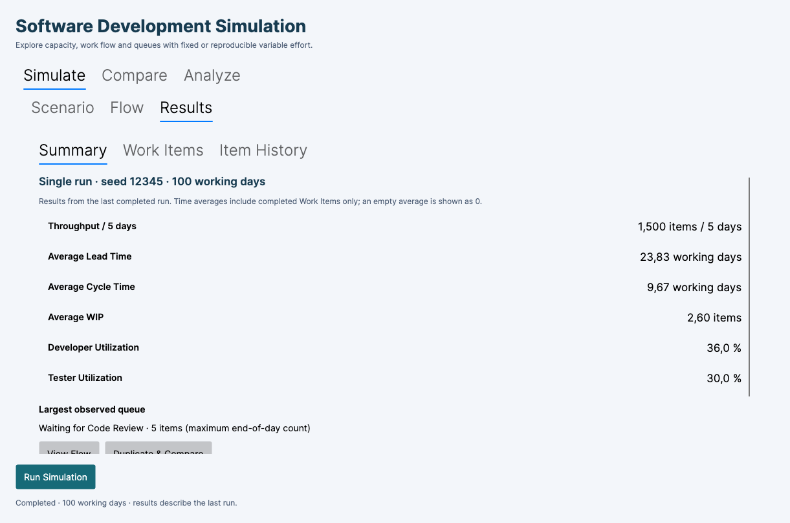
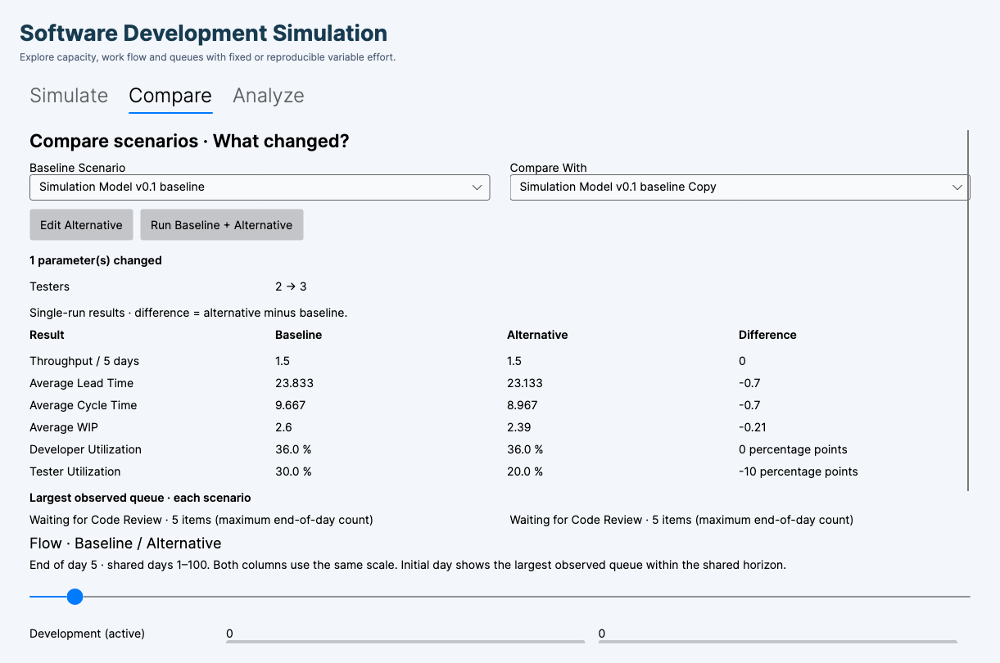

# Step 11 — GUI simplification

This is a presentation/workflow increment. Core, Application, Infrastructure, simulation semantics, random sequences, metric calculations and persistence schema are unchanged. No continuous mode or new simulation feature was added.

## Navigation and first use

- **Simulate** contains Scenario, Flow and Results. Start with **Run Baseline**. Simulation, Team, Flow/WIP and Work/effort are visible. Quality and Advanced sections are collapsed. Capacity/person, seeds, Monte Carlo run count and examples are under Advanced. Field explanations are tooltips.
- **Results** shows six primary measurements: Throughput / 5 days, Average Lead Time, Average Cycle Time, Average WIP, Developer Utilization and Tester Utilization. Tooltip definitions retain completed-item/full-horizon conventions. Largest observed waiting queue is neutral. All other previous metrics, quality/rework details, maximum rework queue and capacity diagnostics are under Advanced Results. Item tables/history remain available.
- **Compare** starts with Baseline Scenario and Compare With. It displays only changed configuration parameters and six primary differences (plus rework capacity share when enabled). Advanced Comparison retains scenario CRUD, rename, import/export, experiments, demonstrations, all-scenario selection, full metrics and parameters, charts, percentile distributions, paired deltas, seed settings and traceability.
- **Analyze** contains Sensitivity, Model Validation and Monte Carlo. Sensitivity starts with parameter, values, result metric, Run Analysis, a chart and a three-column table. Settings, full table, diagnostic measurements and definitions are expandable. Model Validation is explicitly a model-builder tool. Monte Carlo retains distributions and histograms.

No functionality was removed. Existing controls were relocated or hidden behind local expanders. There is no global advanced toggle and changing visibility cannot change simulation inputs.

## Duplicate & Compare

1. Run Baseline (or another configured scenario).
2. Choose Duplicate & Compare in the completed result summary.
3. Change Testers from 2 to 3 in the Scenario editor.
4. Choose Run Simulation. This applies the comparison draft, runs the alternative and opens Compare with the saved pair selected.
5. Inspect changed parameters, primary differences and flow. Expand Advanced Comparison for other scenarios, Monte Carlo settings or exports.

The reference uses the configuration and immutable result captured by the completed run, even if the form was edited afterwards. The copy has a new identity. Existing experiment scenarios/results are retained. This workflow needs two available slots in the existing 20-scenario limit. It selects single-run mode and common seeds using the completed run's seed; results created with different comparison options become out of date, but are retained. Unrun, unrelated scenarios do not prevent the simple pair from displaying; they still must run before inclusion in the full matrix.

A pair can also be edited/run directly with Edit Alternative and Run Baseline + Alternative. Drafts and outdated results are never presented as current measurements. Transient null selections caused by rebuilding Avalonia selectors do not erase the alternative identity.

## Comparison definitions

Names/identities are not listed as simulation-parameter changes. All other configuration differences are reported using the existing authoritative ScenarioParameters description. This includes stored quality settings while defects are disabled and configured seeds; effective seeds can differ under common-seed comparison settings, and are recorded in Advanced traceability. Multiple changes do not isolate causal effects.

Primary values and differences are taken from the existing ScenarioComparisonRunner output, not recalculated in views. Differences are alternative minus reference. Ratios display as percentages and their differences as percentage points. Monte Carlo simple values are medians; differences of medians are distinct from the paired-difference distribution retained in Advanced Comparison.

P50 means median; P85/P95 are levels at or below which 85%/95% of runs fall (using the existing interpolation). Signed paired percentiles apply to per-run alternative-minus-reference differences. P95 is an upper signed tail, not an improvement score. No red/green ranking or organizational recommendation is produced.

## Flow observations

Simple Compare uses actual single-run end-of-day snapshots. Both columns display the same one-based simulated day and share a scale from zero to the larger scenario's total item count. The initial day is the earliest day containing the largest waiting-queue count in either scenario within their shared horizon. The slider only spans days observed by both scenarios. Longer horizons remain accessible in the existing full flow chart.

The largest-queue summaries independently inspect each complete run and include review, testing and rework waiting queues; ties use earliest observation/stable queue order. They are end-of-day maxima, not within-day peaks, and need not describe the slider's selected day. Monte Carlo does not invent an average flow: it reports the largest available median queue maximum for review/testing, explicitly noting that rework maximum is unavailable in the existing Monte Carlo result.

Simulate Flow retains daily inspection. Stage/queue selection exposes count and semantics; Work Item details opens the existing item selector and full event history. Active WIP limits and daily used/available capacity stay visible. Daily charts and feedback details are collapsed. Flow stage bars use a fixed 0–100 visual scale with exact counts shown; comparison bars use the common total-item scale described above.

## Verification and limitations

Verified on macOS 26.5 ARM64 with .NET SDK 10.0.401. Release build succeeds with 0 warnings and 0 errors. All 191 xUnit tests pass: 77 Core, 80 Application and 34 UI (8 new test cases). New presentation tests cover six primary metrics, single/multiple/no parameter changes, values and signed deltas, percentage points, advanced access, pair selection, independent duplication, unrelated stale scenarios, transient selector resets, shared-horizon flow and invariance for baseline, variable effort and defects/rework.

Avalonia headless/Skia verification followed by a successful native macOS desktop host exercised the actual window, bound controls and commands: Run Baseline → Duplicate & Compare → edit the Testers TextBox to 3 → Run Simulation → Compare; expand Advanced; save/read experiment JSON; navigate/run Sensitivity; navigate Model Validation; run Monte Carlo; inspect Flow. Rendered screenshots were inspected and binding/layout issues corrected. This is automated UI verification, not an independent first-time-user study.

An initial native attempt failed in Avalonia.Native's RenderTimer with error −6661 before window creation. A later normal application launch and a repeated native-window workflow both succeeded. The application was left running. The native workflow was driven programmatically through real controls/commands and screenshots, rather than by an independent human participant.

The inspected code had a day slider and flow charts, not a separate playback implementation. These existing capabilities are retained; no missing prior increment or playback engine was invented. Large scenarios still require scrolling; advanced analysis remains intentionally dense. End-of-day counts can be zero in an active stage even when it used capacity during that day, which follows the unchanged simulation model.

## File inventory

Created:
- `src/Simulation.UI/ViewModels/MainWindowPresentation.cs`
- `src/Simulation.UI/ViewModels/SimpleComparison.cs`
- `src/Simulation.UI/ViewModels/PresentationLabels.cs`
- `tests/Simulation.UI.Tests/PresentationTests.cs`
- `docs/GUI_REDESIGN.md` and `docs/screenshots/step11-{summary,compare}.png`

Modified:
- `src/Simulation.UI/ViewModels/MainWindowViewModel.cs`
- `src/Simulation.UI/ViewModels/CompareViewModel.cs`
- `src/Simulation.UI/ViewModels/SensitivityViewModel.cs`
- `src/Simulation.UI/Views/MainWindow.axaml`
- `src/Simulation.UI/Views/CompareView.axaml`
- `src/Simulation.UI/Views/SensitivityView.axaml`
- `README.md`, `docs/SIMULATION_MODEL.md`

