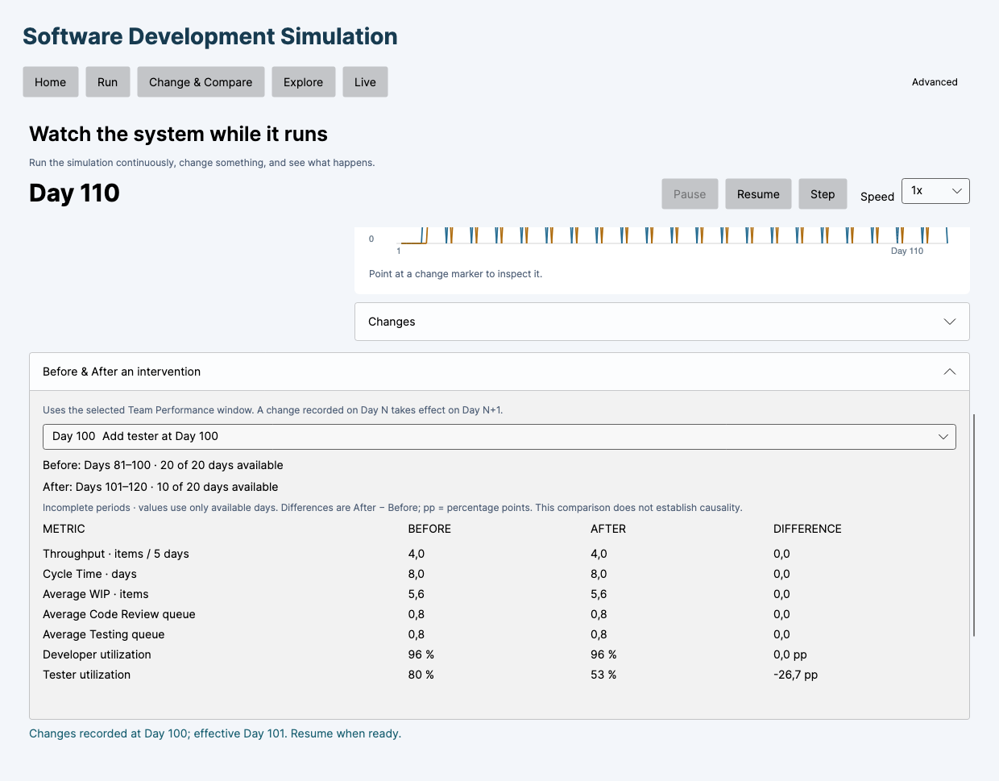
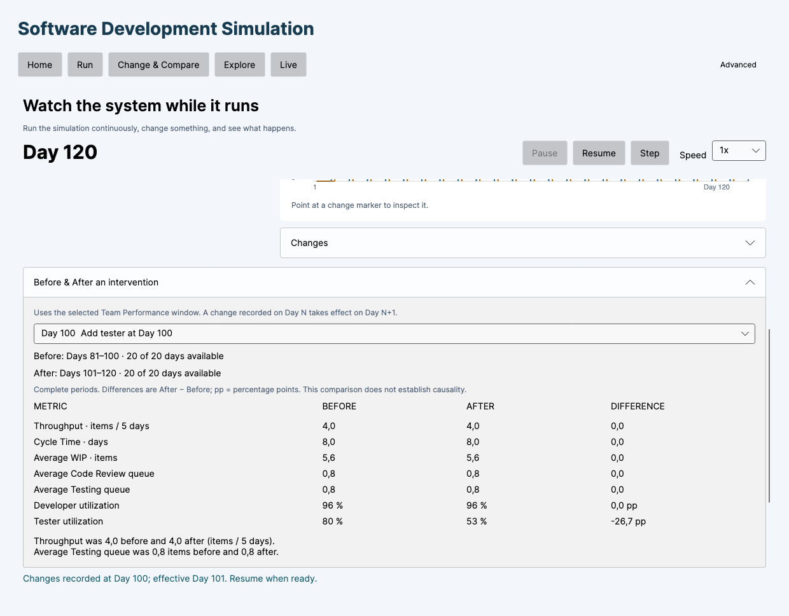

# Step 13 — Before & After boundary verification

Historical verification under model v0.1. Development allocation changed in [model v0.2](DEVELOPMENT_COLLABORATION.md); numerical capacity examples below describe the earlier model.

Verified 2026-09-29. **No production-code defect was found and no production code was changed.**

## Boundary result

For an intervention recorded on Day 100:

| Window | Before, inclusive | After, inclusive |
| --- | --- | --- |
| 10 | 91–100 | 101–110 |
| 20 | **81–100** | **101–120** |
| 50 | 51–100 | 101–150 |
| 100 | 1–100 | 101–200 |

`LivePerformance.Compare` uses `[N - window + 1, N]` and `[N + 1, N + window]`. Neither period shifts as Live continues. There is no gap or extra transition period.

`SimulationSession.ApplyChanges` records the number of completed day intervals as Day N. The already-recorded snapshot at Core index 99 (display Day 100) retains the old configuration. Core index 100 (display Day 101) uses the new configuration. For the verified change from two to three testers, those available capacities are exactly 2 and 3.

## What 121–140 represented

The preceding capacity investigation deliberately continued the simulation to Day 140 to examine downstream propagation after the initial 20-day response. In `LiveCapacityPropagationTests`:

- `Report(..., 121, 140)` explicitly calls `LivePerformance.Period` with those diagnostic dates.
- `LivePerformance.Rolling(session)` at Day 140 naturally describes the recent period 121–140.
- These calls do not select the production intervention comparison period.

The previous conversational report called this later diagnostic period “after”, which was ambiguous. It was **an intentional diagnostic/control selection, not the application's Before & After interval**. The production comparison still uses 101–120, including when the current Live day is 140 or 200. The capacity report now states that distinction explicitly.

## Underlying metrics, not just labels

`InterventionBoundaryTests.EveryComparisonMetricExcludesSentinelsAndIncludesBothBoundaryDays` constructs an analysis-only history with:

- Large outliers on display Days 80 and 121, outside both comparison periods.
- Different values on Days 100 and 101 from each period's interior, proving inclusivity and the split.
- Completions on Days 80, 81, 100, 101, 120 and 121, with different full cycle times.
- Defect events and rework capacity on the same boundaries.
- Current day 140, so substituting the current rolling period 121–140 would produce different results.

This is deliberately synthetic input for analysis isolation, not a claim that the simulator generated those snapshots. Expected values are asserted independently:

| Metric | Before 81–100 | After 101–120 |
| --- | ---: | ---: |
| Completed items | 2 | 2 |
| Throughput, items/5 days | 0.5 | 0.5 |
| Full Cycle Time, days | 12 | 18 |
| Average WIP | 15.4 | 27.6 |
| Average Code Review queue | 2.4 | 5.45 |
| Average Testing queue | 3.4 | 6.45 |
| Average Rework queue | 4.4 | 7.45 |
| Developer Utilization | 80/195 | 158/392 |
| Tester Utilization | 20/42 | 59/84 |
| Defects | 5 | 12 |
| Rework Capacity | 21/80 | 60/158 |

All assertions pass. Daily snapshots are selected using `snapshot.Day + 1`, while completion and defect-event timestamps already use the displayed end-of-day boundary. Cycle time uses the full lifetime of items completed within the period. Utilization retains aggregate used/available capacity semantics.

## Partial periods

The focused tests and the running native UI both confirmed:

| Current Live day | Available After days | Status |
| --- | --- | --- |
| 100 | 0/20 | Incomplete |
| 101 | 1/20 | Incomplete |
| 110 | 10/20 | Incomplete |
| 119 | 19/20 | Incomplete |
| 120 | 20/20 | Complete |
| 140 | 20/20 | Complete, still Days 101–120 |

Before remains Days 81–100 with 20/20 observed days. The After label retains its target range 101–120 while reporting observed-day progress separately. No missing days are extrapolated; the UI explicitly labels incomplete periods, and its factual observations remain withheld until completion.

## Native Avalonia verification

A separate verification host ran the project's existing `MainWindow`, `LiveView` and ViewModels with **Avalonia's native macOS backend**, a desktop application lifetime and real event loop. This was not a headless render.

The host advanced Live Flow Demo to Day 100 using existing commands, opened Change something, changed the actual bound Testers TextBox to 3, and applied an intervention labeled “Add tester at Day 100”. It expanded Before & After and selected that intervention using the bound ComboBox.

At each day in the partial-period table, it read and asserted the actual visible TextBlock values in the comparison panel, then captured the running view with `RenderTargetBitmap`. It also changed the actual performance-window ComboBox to 10, 50, 100 and back to 20 and verified the displayed dates. The window closed automatically after all checks passed.

This is automated interaction with native Avalonia controls, rather than a manual human mouse/keyboard walkthrough. The captured views were visually inspected; no production UI changes were required.






The standalone host is retained under `docs/verification/step13-boundaries/`. It references the production UI project and adds no package or runtime dependency to the application. It is intentionally outside the normal solution test run because it opens a native desktop window.

```sh
dotnet run --project docs/verification/step13-boundaries/NativeVerification.csproj -c Release -- /tmp/flowsim-step13-boundaries
```

## Changes and full verification

Added:

- `tests/Simulation.Application.Tests/InterventionBoundaryTests.cs`: 11 cases covering four window sizes, six progress checkpoints and all metric boundaries using sentinel data.
- `tests/Simulation.UI.Tests/InterventionBoundaryViewModelTests.cs`: one command/presentation test covering exact strings, partial status, window changes, stable intervention selection and anchored periods at Day 140.
- This report, native verification host and three verification images.

Updated the earlier capacity report to clarify 121–140, and README to link this final verification.

Commands:

```sh
dotnet build SoftwareDevelopmentSimulation.sln -c Release --disable-build-servers
dotnet test SoftwareDevelopmentSimulation.sln -c Release --no-build --disable-build-servers
```

Result: **294 passed, 0 failed, 0 skipped** (95 Core, 121 Application, 78 UI), **0 build warnings and 0 errors**. All 282 previous cases, including the eight developer-capacity validation cases, remain green. The native verification host also completed successfully.

Simulation flow, rolling formulas, intervention timing, history, arrivals, checkpoints, random state, WIP and capacity semantics are unchanged. No Technical Debt or future feature was implemented.

**Step 13 — Live Team Performance is implemented and verified.**
