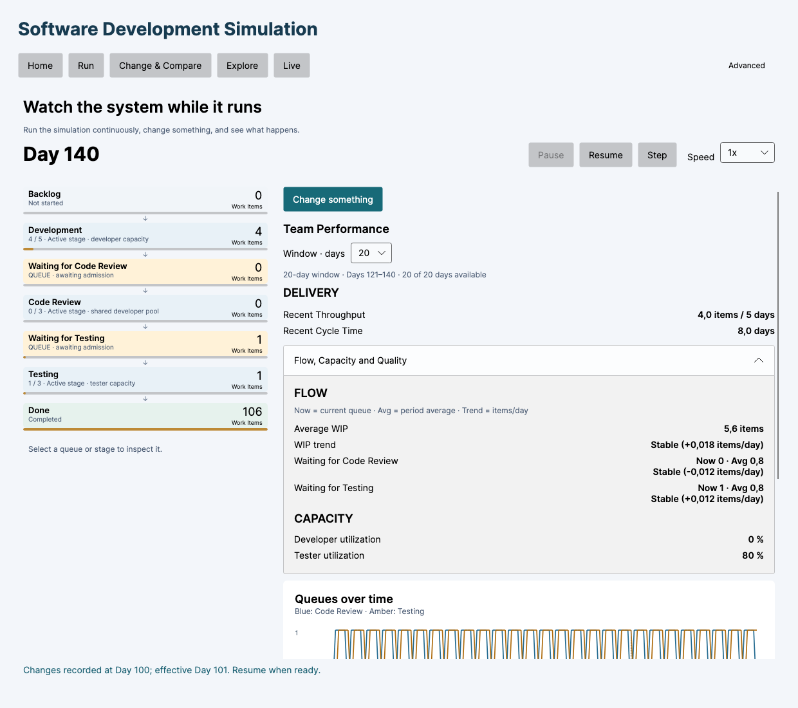
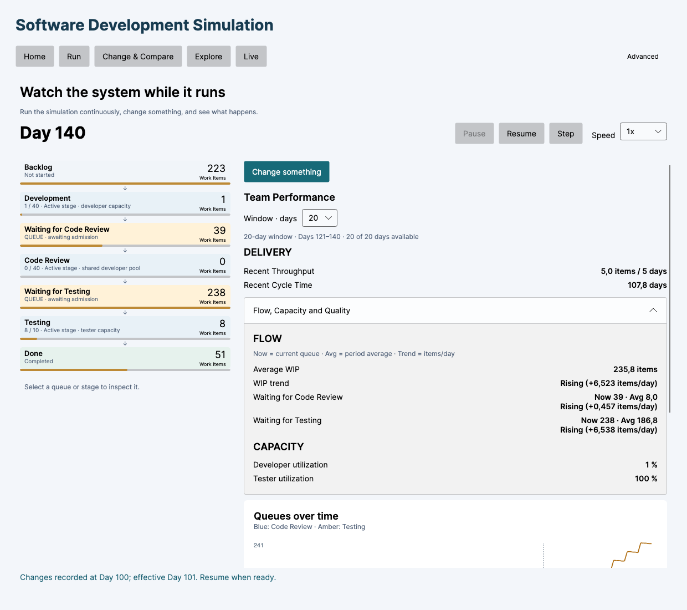

# Step 13 validation: developer capacity and Testing

Historical verification under model v0.1. Development allocation changed in [model v0.2](DEVELOPMENT_COLLABORATION.md); numerical capacity examples below describe the earlier model.

Verified 2026-09-29 against the implementation following commit `a96aa48`.

**Period clarification:** Days 121–140 below are a deliberately selected later diagnostic/control period. They are not the automatic Before & After interval for the Day-100 intervention. That comparison uses Before 81–100 and After 101–120; see [the independent boundary verification](LIVE_BOUNDARY_VERIFICATION.md).

## Root cause

**The unchanged Tester Utilization in the specified Live Flow Demo is correct simulation behavior.** The developer-count intervention works, history is preserved, the downstream flow follows the existing rules, and rolling utilization and UI bindings update correctly in the exercised cases.

In the demo, arrivals supply 0.8 items/day. Each item needs 5 Development, 1 Code Review and 2 Testing capacity units, with defects disabled. Over the observed 20-day periods:

- Development and review consume `0.8 × (5 + 1) = 4.8` developer units/day.
- Testing consumes `0.8 × 2 = 1.6` tester units/day.
- Two testers provide 2 units/day, so utilization is `32 / 40 = 80%`.

The actual limiting supply in this run is the arrival rate. Development WIP 5, effort 5 and the one-unit/item/day cap permit at most 1 item/day through Development; review WIP 3 permits 3/day; Testing with two testers and effort 2 permits 1/day. These bounds exceed the observed arrival rate. The existing five developers supply the 4.8 units/day actually consumed. Raising the count to 5000 changes capacity, but neither arrivals nor per-item work limits change.

This is an explanation of this measured scenario, not an automatic diagnostic added to the product. Other parameter combinations produce different outcomes.

## Reproduction and evidence

The demo used the requested values exactly: developers 5, testers 2, person capacities 1/1, WIP 5/3/3 (Rework 3), effort 5/1/2, no defects, empty initial backlog, continuous arrivals 0.8/day, seed 12345. At Day 100, Developers changed to 5000. A control continued from the same captured Day-100 state without the intervention.

All active-WIP values below are averages of snapshots sampled after admission, before work. Queue counts are end-of-day averages. The Flow Board displays end-of-day state counts, which can differ from active occupancy earlier that day.

| Demo measure | Days 81–100 | Days 101–120 | Days 121–140 |
| --- | ---: | ---: | ---: |
| Available developer capacity/day | 5 | 5000 | 5000 |
| Used developer capacity/day | 4.8 | 4.8 | 4.8 |
| Development active WIP | 4.0 | 4.0 | 4.0 |
| Waiting for Code Review | 0.8 | 0.8 | 0.8 |
| Code Review active WIP | 0.8 | 0.8 | 0.8 |
| Waiting for Testing | 0.8 | 0.8 | 0.8 |
| Testing active WIP | 1.6 | 1.6 | 1.6 |
| Available tester capacity/day | 2 | 2 | 2 |
| Used tester capacity/day | 1.6 | 1.6 | 1.6 |
| Tester Utilization | 80% | 80% | 80% |
| Throughput, items/5 days | 4.0 | 4.0 | 4.0 |
| Developer Utilization | 96% | 0.096% | 0.096% |

The simple view rounds 0.096% developer utilization to 0%; actual precision is preserved internally. The unchanged five-developer control also has 80% tester utilization in Days 121–140. Both runs retain exactly 112 arrivals at Day 140.

## Controlled downstream propagation

The diagnostic uses developers **1 → 5000 at Day 100**, testers 2, WIP **40/40/10**, arrival **4 items/day**, empty initial backlog, effort 5/1/2, person capacities 1/1, defects off and seed 12345. The initial low developer capacity accumulates a backlog. This supplies work after the intervention without changing arrivals or tester capacity. A control branches from the same Day-100 state and keeps one developer.

| Measure | Before 81–100 | After 101–120 | Later 121–140 | One-developer control 121–140 |
| --- | ---: | ---: | ---: | ---: |
| Available developer capacity/day | 1 | 5000 | 5000 | 1 |
| Used developer capacity/day | 1 | 46.05 | 48 | 1 |
| Development active WIP | 40 | 40 | 40 | 40 |
| Waiting for Code Review | 0.15 | 8 | 8 | 0.15 |
| Code Review active WIP | 0.15 | 6.05 | 8 | 0.15 |
| Waiting for Testing | 0.15 | 48.7 | 186.8 | 0.15 |
| Testing active WIP | 0.3 | 7.1 | 10 | 0.4 |
| Available tester capacity/day | 2 | 2 | 2 | 2 |
| Used tester capacity/day | 0.3 | 1.5 | 2 | 0.4 |
| Tester Utilization | 15% | 75% | 100% | 20% |
| Throughput, items/5 days | 0.75 | 3.75 | 5 | 1 |

Active WIP measures occupancy, not how many items received capacity. The low-developer run has 40 admitted Development items but only one used developer unit/day. The high-developer run temporarily processes backlog faster than the arrival rate; its growing Testing queue is not steady state.

The daily trace locates the propagation:

| Display day | Developer used/available | Active Dev/Review/Test | Waiting Review/Test | Tester used/available | Total Done |
| --- | --- | --- | --- | --- | ---: |
| 100 | 1/1 | 40/0/0 | 0/0 | 0/2 | 16 |
| 101 | 40/5000 | 40/0/0 | 1/0 | 0/2 | 16 |
| 102 | 41/5000 | 40/1/0 | 0/1 | 0/2 | 16 |
| 103 | 40/5000 | 40/0/1 | 0/0 | 1/2 | 16 |
| 104 | 40/5000 | 40/0/1 | 0/0 | 1/2 | 17 |
| 105 | 40/5000 | 40/0/0 | 39/0 | 0/2 | 17 |
| 106 | 79/5000 | 40/39/0 | 1/39 | 0/2 | 17 |
| 107 | 41/5000 | 40/1/10 | 0/30 | 2/2 | 17 |
| 108 | 40/5000 | 40/0/10 | 0/30 | 2/2 | 19 |

Across Days 101–140, stage-entry/completion counts in high-capacity versus control were: Development 281/7; Waiting for Code Review 320/7; Code Review 281/7; Waiting for Testing 281/7; Testing 43/7; Done 35/7. Some items were already in Development at intervention time, so stage totals differ. Tests verify the ordered transitions and complete two-unit Testing effort of the items completed after the intervention.

## Implementation audit

- `SimulationSession.ApplyChanges` records Day N and replaces the active configuration. It does not advance time or mutate items, daily history, queues, arrival accumulator, next ID or random states.
- `SimulationSession.AdvanceOneDay` constructs each day's scenario from the active configuration. `SimulationEngine.AdvanceOneDay` reads that day's team totals; capacity is not cached at session creation.
- Snapshots record actual work by stage and each resource pool's available capacity. Tests independently reconcile tester work against the sum of per-item TestingWork.
- `LivePerformance.Period` filters snapshots by one-based display day and divides sum used tester capacity by sum available tester capacity. It does not use developer fields, lifetime averages or a previous Run result.
- `LiveViewModel` refreshes performance after each day and raises notifications. The developer field in Change something writes through to the draft and Apply records the new count.
- `SimulationEngine.Run` advances a `SimulationSession`, sharing the same daily engine as Live. Fixed-backlog results, including every daily snapshot and item history, match exactly at both 1 and 5000 developers.

## Tests and UI verification

Added `tests/Simulation.Application.Tests/LiveCapacityPropagationTests.cs` with six cases:

1. Demo/control reproduction with unchanged tester usage and utilization.
2. Extreme developer-count intervention preserving previous snapshots, remaining effort, item state/queues, arrival continuation and all three random states; future available capacity changes correctly.
3. Abundant-work propagation through every stage, per-item Testing effort and daily capacity ledger assertions; daily diagnostics are emitted into test output.
4. Rolling utilization verified at every day from 101–145, including a tester count change at Day 114. At Day 120 the window is 101–120 with available capacity `14×2 + 6×4 = 52`; the aggregate ratio differs from the average of daily percentages. Old days leave the rolling window correctly.
5–6. Run/Live equivalence for fixed backlog at 1 and 5000 developers.

Added `tests/Simulation.UI.Tests/LiveCapacityPropagationViewModelTests.cs` with two cases exercising the real change-field setter, commands, notifications and formatted rolling values for demo and supplied-work configurations.

The actual `MainWindow`/Live view was additionally instantiated with Avalonia Headless and Skia. Commands were executed and dispatcher jobs processed after each day. The bound **TextBlock** was read independently of the ViewModel and matched its value: demo **80% → 80%**, supplied **15% → 100%**. The rendered views were visually inspected. This checks actual bindings/layout, but is not a manual native macOS mouse/keyboard session.





Final Release build: **0 warnings and 0 errors**. Full suite: **282 passed, 0 failed, 0 skipped** (95 Core, 110 Application, 77 UI), including all 274 existing cases and eight new cases.

```sh
dotnet build SoftwareDevelopmentSimulation.sln -c Release --disable-build-servers
dotnet test SoftwareDevelopmentSimulation.sln -c Release --no-build --disable-build-servers
# Detailed propagation trace:
dotnet test tests/Simulation.Application.Tests -c Release --filter FullyQualifiedName~LiveCapacityPropagationTests --logger 'console;verbosity=detailed'
```

## Changes and expected result

Only validation tests and documentation were added. **No production code or simulation semantics changed.** Existing capacity/WIP/queue/throughput measures expose the behavior; no extra normal-UI diagnostics, automatic classifications or management recommendations were needed.

In the ordinary demo, 5 → 5000 developers changes future developer capacity and developer utilization while Tester Utilization remains 80%. In the supplied-work diagnostic, the additional developer capacity propagates through review and the testing queue; utilization increases after stage delays and as new days enter the rolling window, reaching 100% in the measured later window. It need not jump immediately on the intervention day.

No Live, rolling calculation, history or UI binding defect was found in these reproductions. No Technical Debt or future-roadmap work was performed.
