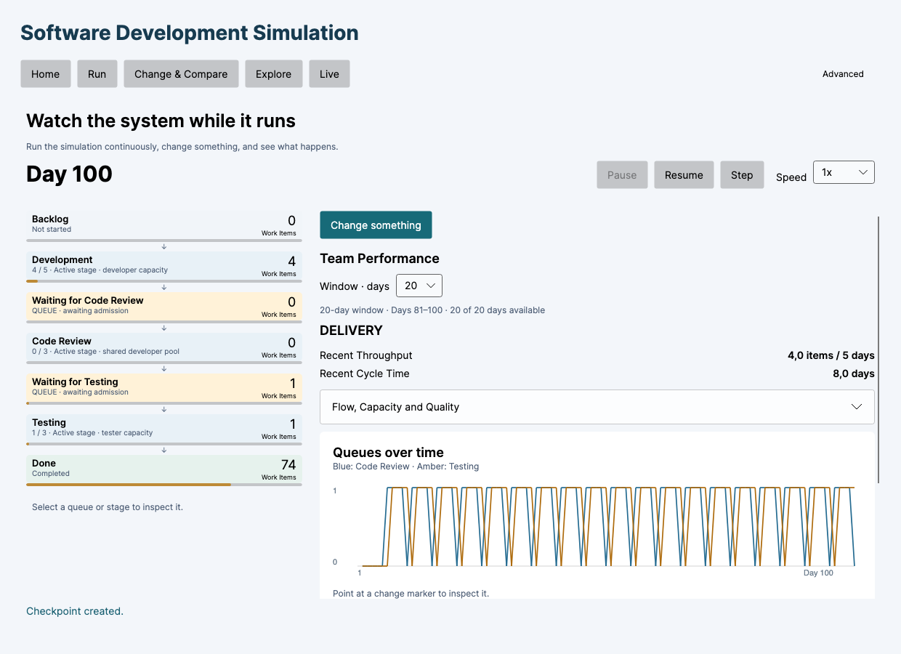
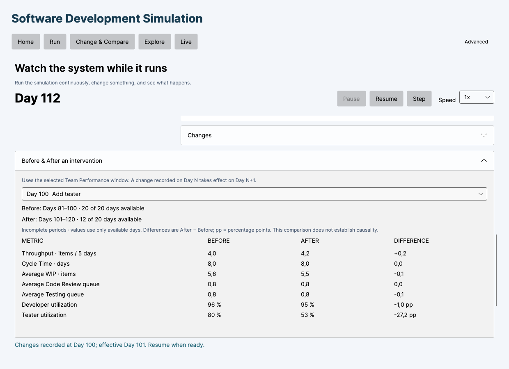
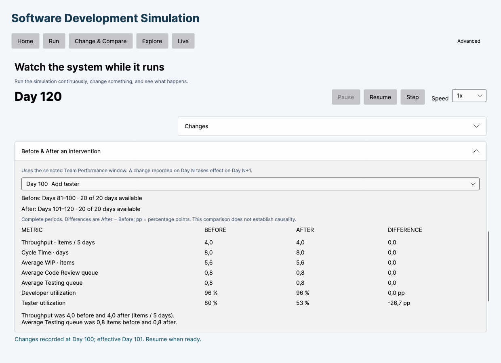
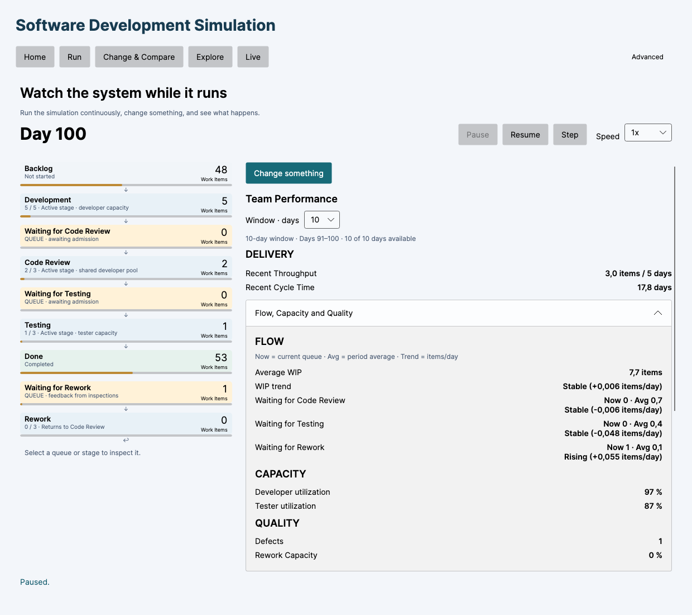

# Step 13 — Live Team Performance

Implemented 2026-09-28. Release build and automated verification pass. The actual Avalonia views were rendered and visually inspected; a manual interactive macOS run remains unverified.

## Existing state found

Before editing, the complete solution built with no warnings or errors and all 252 tests passed (95 Core, 91 Application, 66 UI).

Step 12 already provided the shared daily engine, continuous arrivals, pause/resume/step, live changes, checkpoints, JSON continuation, queue history with intervention markers, and selectable 10/20/50/100-day windows. `RollingMetrics` already calculated throughput, average WIP and utilization from aggregate used/available capacity. Its UI showed throughput, current WIP, all-time completions and utilization.

Rolling cycle time, OLS trends, rolling quality metrics, separate current/average queue presentation, and intervention Before/After analysis were absent. These were added without changing Core, Infrastructure, persistence schema, simulation execution or random streams. Existing rolling metrics remain compatible with earlier consumers.

## Changes

- `src/Simulation.Application/LivePerformance.cs`: inclusive performance periods, completion-based cycle time/throughput, queue averages, OLS trends, capacity/quality measures, Before/After boundaries, available-day counts and overlapping-intervention count.
- `src/Simulation.UI/ViewModels/LivePerformancePresentation.cs`: neutral labels, stable threshold, unavailable states, comparison rows and at most two factual observations. All calculations concerning simulation history remain in Application.
- `src/Simulation.UI/ViewModels/LiveViewModel.cs`: selected rolling period and intervention, refreshed analysis after steps/loads/restores/window changes, stable intervention selection during binding refreshes.
- `src/Simulation.UI/Views/LiveView.axaml`: compact Delivery next to the existing Flow Board, expandable Flow/Capacity/Quality, window selector and expandable Before/After table. Current WIP and all-time completions remain available through the Flow Board and existing details.
- `tests/Simulation.Application.Tests/LivePerformanceTests.cs` and `tests/Simulation.UI.Tests/LivePerformanceViewModelTests.cs`: focused analysis and presentation regression coverage.

No runtime package was added. No score, causal attribution, management recommendation, Technical Debt or other future feature was introduced.

## Calculation semantics

- Display days are one-based. Core snapshots remain zero-based: snapshot `Day = 80` is displayed as Day 81. At Day 100, a 20-day period contains Days 81–100 inclusive.
- Throughput selects Done timestamps inside the period and divides completions by the number of observed days, then multiplies by five. Empty periods are displayed as unavailable.
- Cycle time averages the full `DoneDay - DevelopmentStartedDay` for those completions. It is unavailable if there are no completions; it is never clipped to the period.
- WIP and queue averages use end-of-day snapshots. Queues separately display latest count, period average and trend.
- OLS uses actual day indexes and all daily observations: `sum((x - mean(x)) * (y - mean(y))) / sum((x - mean(x))²)`. Fewer than three observations are unavailable. Absolute slopes strictly below 0.05 items/day display Stable; the signed slope remains visible to three decimals.
- Utilization is `sum(used) / sum(available)` for each resource pool, including changes in capacity. A zero denominator displays Unavailable.
- Defects count discovery events inside the period, including repeat discoveries. Rework Capacity is actual developer capacity spent on Rework divided by total actual developer capacity used; zero used capacity displays Unavailable.
- Quality is visible when enabled now or relevant to the period's history, including outstanding rework after disabling defects. Turning quality off does not erase its historical measures.
- A change recorded at Day N takes effect on Day N+1. With a 20-day window at N=100, Before is 81–100 and After is 101–120. The periods remain anchored to the selected intervention as the simulation continues.
- Both periods expose observed/expected day counts. Partial values use only observed days, with no extrapolation. Factual observations are withheld until both periods are complete. Early interventions also expose insufficient Before history.
- Queue comparisons use averages, never ending queue counts. Utilization and Rework Capacity differences use percentage points. Other overlapping interventions are explicitly counted; the comparison does not isolate causality.

## Automated verification

Commands on macOS ARM64, .NET SDK 10.0.401:

```sh
dotnet build SoftwareDevelopmentSimulation.sln -c Release --disable-build-servers
dotnet test SoftwareDevelopmentSimulation.sln -c Release --no-build --disable-build-servers
```

Final result: **0 warnings, 0 errors; 274 passed, 0 failed, 0 skipped** (95 Core, 104 Application, 75 UI). All 252 existing cases remain green, with 22 added cases.

New coverage includes:

- Exact rolling and Before/After boundaries, completions on either side of boundaries, full cycle times beginning before the period, throughput normalization.
- Unequal capacity denominators, zero capacity, positive/negative/near-zero OLS slopes, an OLS case that differs from an endpoint estimate, actual day indexes and insufficient observations.
- Strict classification around ±0.05, queue period averages, partial After day counts, percentage-point deltas.
- Known defect discovery timestamps and Rework Capacity, historical quality after disabling defects.
- Day-100 checkpoint/save/load/restore determinism, early and overlapping interventions, invalid analysis requests.
- Window changes, selection changes, transient ComboBox deselection, unavailable values, quality visibility and stale-state clearing on reset/restore.

## Demo and visual validation

The existing Live Flow Demo was executed through the actual `LiveViewModel` and rendered `MainWindow`/`LiveView` using Avalonia 11.3.22 Headless with Skia. The temporary renderer referenced the existing UI project; it added no production dependency. Rendered images were visually inspected at 1240×900, 960×680 and, for expanded quality details, 1240×1100.

Configuration: developers 5, testers 2, capacities 1/1, WIP 5/3/3 and Rework 3, effort 5/1/2, defects off, continuous arrivals 0.8/day, seed 12345. A checkpoint was created at Day 100, testers changed to 3 with label **Add tester**, then the session advanced through Days 112 and 120.

| Metric | Before 81–100 | After 101–120 |
| --- | ---: | ---: |
| Throughput, items / 5 days | 4.0 | 4.0 |
| Cycle Time, days | 8.0 | 8.0 |
| Average WIP | 5.6 | 5.6 |
| Average Code Review queue | 0.8 | 0.8 |
| Average Testing queue | 0.8 | 0.8 |
| Developer utilization | 96% | 96% |
| Tester utilization | 80% | 53.33% |

Tester utilization difference is −26.67 percentage points. These are observed values, not expected values hard-coded into the implementation or a claim about the cause of a change.

The rendered Day-112 view explicitly showed **12 of 20 days available**. At Day 120, switching the window to 10 updated the comparison to 91–100 / 101–110. The quality-enabled example showed separate defect/rework measures and all three queue trends. The smaller window retained a vertically scrollable comparison.

Visual inspection initially found that a binding refresh could clear the selected intervention. The list is now stable across unchanged history updates and transient null selection is ignored. A second rendering run confirmed that comparison values persist through day stepping and window changes.









## Remaining verification

No known Step 13 calculation or presentation defect remains from the checks above. **A manual interactive run in the native macOS application has not been performed in this session**; available computer-control tools do not support native app interaction. Headless rendering and programmatic ViewModel actions do not verify native mouse/keyboard input or real-time playback responsiveness.

To complete that check, run the UI, open Live Flow Demo, pause at Day 100, create the checkpoint, use Change something → Testers 3 → label Add tester → Apply Changes, then continue through Day 120. Expand Before & After, verify partial progress and complete boundaries, change the window, and restore the checkpoint. Also inspect the expandable metrics while playback is running.

```sh
dotnet run --project src/Simulation.UI -c Release --no-build
```

No Technical Debt work was started.
