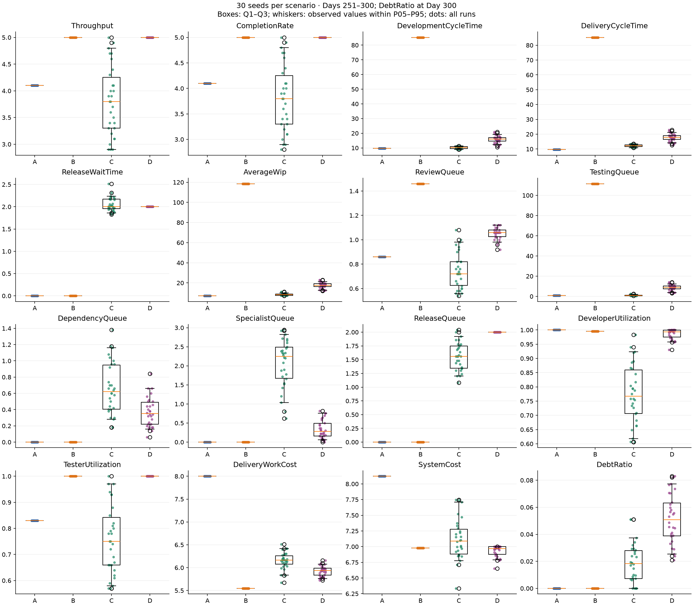
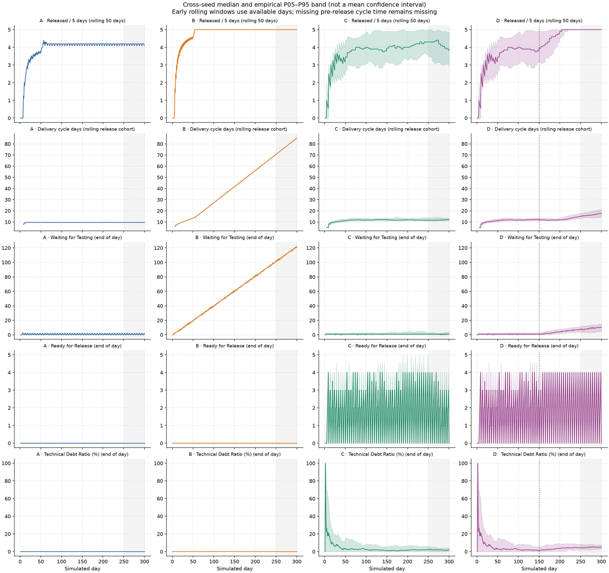
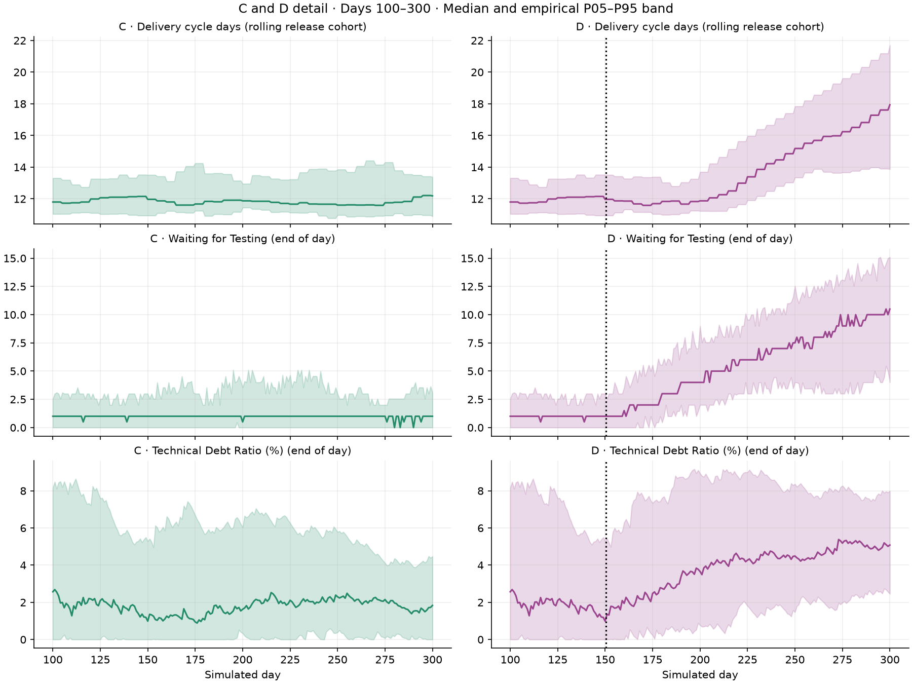

# Multi-Seed Validation v1

**Assessment: MIXED — some key conclusions depend substantially on seed.**

Validation completed 2026-10-09, model version 0.8. All 120 runs passed the existing Model Validation v2 invariants. No production simulation or UI code changed. The mixed assessment describes outcome robustness, not a failed accounting or determinism check.

The strongest conclusions are B's throughput/cost/Testing bottleneck trade-off and D's lower specialist waiting with higher Testing queues. C's throughput relative to A is seed-dependent. D's Delivery Cycle Time and debt ratio usually increase but each reverses direction for one seed. The original seed 12345 is therefore insufficient to describe all outcomes.

**Thirty seeds characterize variation under the chosen model and configurations, not real-world forecasting uncertainty.**

## Experiment and definitions

Seeds 12345–12374, four scenarios per seed, 300 simulated days, final window **Days 251–300 inclusive**. D applies the identical combined intervention on Day 150, effective Day 151. Twelve additional runs repeat all four scenarios at seeds 12345, 12359 and 12374; those repeats are excluded from statistical sample sizes.

The harness links the prior scenario definitions and invariant checker directly. The seed-12345 results match the archived Model Validation v2 metrics, including all five requested waiting queues. C/D histories match exactly through Day 150 for every seed.

| Scenario | Configuration |
| --- | --- |
| A | AlwaysAvailable; 5 developers, 2 testers; availability 1; active WIP limits Development/Review/Testing 5/3/3; fixed effort 5/1/2; productivity 1/1/1; defects off; no specialists, dependencies, shortcuts or repayment; unrestricted flow release. |
| B | A with Development productivity 2.0. |
| C | Development productivity 1.5; 1 specialist, specialist demand rate .30; residual dependency rate .25, mean wait 4 days; shortcut rate .30, reduction .50, creation factor 2, tolerance .10, repayment .20, impact 1; scheduled release capacity 5 every 5 days. Other settings as A. |
| D | C until Day 150; specialists 1→2, dependency rate .25→.10, release capacity 5→10; remaining settings unchanged. |

Exact requests and intervention records are in [raw results](verification/multi-seed-v1/raw-results.json). This experiment cannot isolate individual specialist, dependency, debt, release or intervention effects. In particular, C also differs from A in Development productivity.

Queue metrics below are average daily end-of-day counts in Days 251–300; final queues are separate. Utilization and DebtRatio are fractions. DebtRatio is the Day-300 value, matching v2, not a window average. ReleasedCumulative covers all 300 days. Rates are items per five days; cycle/wait times are simulated days; costs are raw capacity units per item, not money. Specialist and dependency queues are subsets and are not added to total WIP again.

Delivery cycle and release wait use the released cohort; Development cycle and Delivery Work Cost use the work-completed cohort. System Cost uses capacity consumed during the period divided by period releases. These population distinctions remain unchanged.

## Statistical method

All final metric summaries have n=30 and no missing values. Sample SD uses n−1. Percentiles use **Hyndman–Fan type 7**, linear interpolation at zero-based position (n−1)p. Mean 95% intervals use **Student t**, mean ± t(0.975,29)·SD/√30, with critical value 2.045229642. Paired comparisons calculate the 30 same-seed differences first; the two outcomes within each pair are not treated as independent observations. Direction counts use an absolute 1e−9 tie tolerance before rounding.

These intervals estimate Monte Carlo mean uncertainty under an approximate independent-seed working assumption. They are not outcome ranges, prediction intervals or evidence of real-world model validity. Consecutive deterministic seeds do not prove independence. Intervals are exploratory and unadjusted for multiple metrics; normality of individual outcomes is not assumed. A/B have no active randomness in these configurations, hence zero observed SD and degenerate intervals. That is a model/configuration property, not thirty independent real-world confirmations.

For example, C throughput has mean **3.810**, sample SD **0.648**, median **3.800**, observed range **2.900–5.000**, empirical P05–P95 **2.900–4.855**, and mean 95% CI **3.568–4.052**. The narrower mean CI must not be interpreted as where 95% of runs fall.

## Scenario summary

The compact table reports means and sample SD. The [complete scenario table](verification/multi-seed-v1/scenario-summary.md) and [JSON summary](verification/multi-seed-v1/summary.json) include mean, median, SD, min, max, P05, P95 and mean CI for **every metric**, including cumulative Released and all final waiting queues.

| Metric | A mean ± SD | B mean ± SD | C mean ± SD | D mean ± SD |
| --- | --- | --- | --- | --- |
| Throughput | 4.1000 ± 0.0000 | 5.0000 ± 0.0000 | 3.8100 ± 0.6477 | 5.0000 ± 0.0000 |
| CompletionRate | 4.1000 ± 0.0000 | 5.0000 ± 0.0000 | 3.8067 ± 0.6528 | 5.0000 ± 0.0000 |
| DevelopmentCycleTime | 9.6341 ± 0.0000 | 85.2600 ± 0.0000 | 10.1540 ± 0.7724 | 15.7927 ± 2.4246 |
| DeliveryCycleTime | 9.6341 ± 0.0000 | 85.2600 ± 0.0000 | 12.2013 ± 0.8008 | 17.7927 ± 2.4246 |
| ReleaseWaitTime | 0.0000 ± 0.0000 | 0.0000 ± 0.0000 | 2.0531 ± 0.1561 | 2.0000 ± 0.0000 |
| AverageWip | 7.1800 ± 0.0000 | 118.5800 ± 0.0000 | 8.4807 ± 1.0385 | 17.6340 ± 2.7799 |
| ReviewQueue | 0.8600 ± 0.0000 | 1.4600 ± 0.0000 | 0.7500 ± 0.1483 | 1.0533 ± 0.0477 |
| TestingQueue | 0.8600 ± 0.0000 | 111.5400 ± 0.0000 | 1.0093 ± 0.5125 | 8.7127 ± 2.7806 |
| DependencyQueue | 0.0000 ± 0.0000 | 0.0000 ± 0.0000 | 0.6627 ± 0.3200 | 0.3693 ± 0.1820 |
| SpecialistQueue | 0.0000 ± 0.0000 | 0.0000 ± 0.0000 | 2.0653 ± 0.6243 | 0.3347 ± 0.2403 |
| ReleaseQueue | 0.0000 ± 0.0000 | 0.0000 ± 0.0000 | 1.5580 ± 0.2524 | 2.0000 ± 0.0000 |
| DeveloperUtilization | 1.0000 ± 0.0000 | 0.9958 ± 0.0000 | 0.7755 ± 0.1034 | 0.9861 ± 0.0181 |
| TesterUtilization | 0.8300 ± 0.0000 | 1.0000 ± 0.0000 | 0.7577 ± 0.1317 | 1.0000 ± 0.0000 |
| DeliveryWorkCost | 8.0000 ± 0.0000 | 5.5469 ± 0.0000 | 6.1516 ± 0.1816 | 5.9257 ± 0.1115 |
| SystemCost | 8.1220 ± 0.0000 | 6.9787 ± 0.0000 | 7.1124 ± 0.3201 | 6.9304 ± 0.0906 |
| DebtRatio | 0.0000 ± 0.0000 | 0.0000 ± 0.0000 | 0.0185 ± 0.0143 | 0.0512 ± 0.0181 |
| ReleasedCumulative | 245.0000 ± 0.0000 | 296.0000 ± 0.0000 | 235.8333 ± 17.1365 | 262.7667 ± 11.5062 |
| FinalTestingQueue | 1.0000 ± 0.0000 | 122.0000 ± 0.0000 | 1.0000 ± 1.0505 | 10.2000 ± 3.2737 |
| FinalReleaseQueue | 0.0000 ± 0.0000 | 0.0000 ± 0.0000 | 0.0000 ± 0.0000 | 0.0000 ± 0.0000 |

## Paired comparisons

The [complete paired table](verification/multi-seed-v1/paired-comparison.md) additionally contains median and SD of differences for every metric. [Paired JSON](verification/multi-seed-v1/paired.json) retains all 30 unrounded differences per metric.

| Comparison | Metric | Mean paired Δ | 95% CI of mean Δ | Increase / decrease / tie |
| --- | --- | --- | --- | --- |
| B − A | Throughput | 0.9000 | [0.9000, 0.9000] | 30 / 0 / 0 |
| B − A | DeliveryCycleTime | 75.6259 | [75.6259, 75.6259] | 30 / 0 / 0 |
| B − A | TestingQueue | 110.6800 | [110.6800, 110.6800] | 30 / 0 / 0 |
| B − A | SpecialistQueue | 0.0000 | [0.0000, 0.0000] | 0 / 0 / 30 |
| B − A | DeliveryWorkCost | -2.4531 | [-2.4531, -2.4531] | 0 / 30 / 0 |
| B − A | DebtRatio | 0.0000 | [0.0000, 0.0000] | 0 / 0 / 30 |
| C − A | Throughput | -0.2900 | [-0.5319, -0.0481] | 8 / 20 / 2 |
| C − A | DeliveryCycleTime | 2.5672 | [2.2682, 2.8662] | 30 / 0 / 0 |
| C − A | TestingQueue | 0.1493 | [-0.0420, 0.3407] | 14 / 15 / 1 |
| C − A | SpecialistQueue | 2.0653 | [1.8322, 2.2984] | 30 / 0 / 0 |
| C − A | DeliveryWorkCost | -1.8484 | [-1.9162, -1.7806] | 0 / 30 / 0 |
| C − A | DebtRatio | 0.0185 | [0.0131, 0.0238] | 25 / 0 / 5 |
| D − C | Throughput | 1.1900 | [0.9481, 1.4319] | 29 / 0 / 1 |
| D − C | DeliveryCycleTime | 5.5913 | [4.5760, 6.6066] | 29 / 1 / 0 |
| D − C | TestingQueue | 7.7033 | [6.7091, 8.6976] | 30 / 0 / 0 |
| D − C | SpecialistQueue | -1.7307 | [-1.9398, -1.5215] | 0 / 30 / 0 |
| D − C | DeliveryWorkCost | -0.2259 | [-0.2786, -0.1731] | 2 / 28 / 0 |
| D − C | DebtRatio | 0.0327 | [0.0272, 0.0383] | 29 / 1 / 0 |

### A versus B

All four requested effects occur in **30/30 seeds**:

- Released throughput rises **4.10→5.00** per five days, +0.90 (+22.0%).
- Delivery Work Cost falls **8.000→5.547**, −2.453 (−30.7%).
- Average Waiting for Testing rises **0.86→111.54**, +110.68 items; Day-300 queue rises **1→122**.
- Delivery Cycle Time rises **9.634→85.260**, +75.626 days.

These conclusions are fully consistent across the tested seeds, but A and B are deterministic under these settings. The fixed tester capacity, stage effort, dispatch/admission and unlimited waiting queues are model assumptions that explain this simulated bottleneck. Lower per-item work cost does not imply lower queueing delay.

### A versus C

C introduces substantial within-scenario variation: throughput SD **0.648** (range 2.9–5.0), Delivery Cycle Time SD **0.801** (10.766–13.500), and average Testing queue SD **0.512** (0.54–2.54). Specialist waiting ranges **0.62–2.94** and Day-300 debt ratio **0–5.094%**. A has zero variation here.

Relative to A, C throughput rises in **8**, falls in **20**, and ties in **2** seeds. The mean difference is **−0.290** per five days (95% CI **−0.532 to −0.048**). Seed 12345 gave C=4.9 versus A=4.1; that favorable single-seed direction is not robust.

Testing queue direction is also mixed: **14 increases, 15 decreases, 1 tie**, mean +0.149 and CI −0.042 to +0.341. Conversely, Delivery Cycle Time rises and Delivery Work Cost falls in **all 30 seeds**; mean differences are +2.567 days and −1.848 capacity units/item. Specialist waiting is positive in every C run. Final debt is positive in 25 runs and zero in 5.

These are differences between combined configurations, not estimates of the separate contribution of each organizational mechanism.

### C versus D

The combined package increases Released throughput in **29/30** seeds and ties in one (12357). Mean gain is **1.190** per five days (CI **0.948–1.432**); D reaches 5.0 in every final window. Average specialist waiting decreases in **30/30**, mean **−1.731** items. Average Testing waiting increases in **30/30**, mean **+7.703** (CI **6.709–8.698**).

Delivery Cycle Time increases in **29/30**, mean **+5.591 days** (CI **4.576–6.607**), but decreases by **0.854** days for seed **12368**. DebtRatio increases in **29/30**, mean **+3.274 percentage points** (CI **2.716–3.832**), but decreases by **0.228 percentage points** for seed **12364**. Those outcomes vary in direction despite their clear mean shifts.

Delivery Work Cost falls in 28 seeds and rises in 2 (12354 and 12357), mean −0.226. D does not uniformly improve all outcomes. All statements concern the package, not a causal attribution to any one of its three components. After configuration paths diverge, matching seeds also does not imply every item receives an identical random assignment.

## Trajectories and accumulation

[Raw time series](verification/multi-seed-v1/time-series.json) contain all five requested metrics for every run and every day. [Bands](verification/multi-seed-v1/time-series-bands.json) report per-day cross-seed median and empirical P05/P95, with sample counts. Early no-release cycle times remain null. Throughput and cycle time use authoritative rolling 50-day histories (available days before Day 50); Testing/Release queues and debt are daily observations. Debt trajectories are in percent. Cumulative Released is never mixed with rolling rates.

Bands are pointwise outcome variation, **not confidence intervals for the mean** or simultaneous bands. Successive rolling windows are correlated and not additional replicates.

To inspect more than the final window, the following table gives the cross-seed mean of **daily Testing queue counts** in six consecutive 50-day blocks:

| Scenario | Days 1–50 | 51–100 | 101–150 | 151–200 | 201–250 | 251–300 |
| --- | --- | --- | --- | --- | --- | --- |
| A | 0.860 | 0.800 | 0.860 | 0.840 | 0.800 | 0.860 |
| B | 9.780 | 30.100 | 50.460 | 70.800 | 91.160 | 111.540 |
| C | 0.846 | 0.965 | 1.073 | 1.246 | 1.381 | 1.009 |
| D | 0.846 | 0.965 | 1.073 | 2.705 | 6.116 | 8.713 |

- **A:** bounded periodic behavior after warm-up. Testing block means remain approximately 0.8–0.86, and rolling cycle time stays near 9.6 days. This supports an approximately settled regime over the observed horizon.
- **B:** continued accumulation throughout the run, despite throughput flattening at 5. Testing increases roughly **0.40–0.42 items/day in every block**, reaches 122 at Day 300, and rolling cycle time continues rising. Stable throughput is not stable system flow.
- **C:** no sustained aggregate Testing-queue growth across these blocks. Late block means fluctuate 1.073→1.246→1.381→1.009, and cycle time stays near 12 days. Throughput remains variable; the final-window rate is lower than the mean of earlier rolling endpoints. This is compatible with a fluctuating regime over 300 days, but does **not prove stationarity or long-run stability** for each seed.
- **D:** identical to C before intervention, then sustained aggregate Testing accumulation: block means **2.705→6.116→8.713** over Days 151–300. Mean within-block slopes are **+0.0686, +0.0580, +0.0603 items/day**. Final Testing queue mean is **10.2**, range **3–16**. Some individual final-block slopes are negative (range −0.0424 to +0.1454), so increasing aggregate trajectories do not imply every seed grows monotonically. Delivery cycle also rises after the initial intervention transition. Throughput reaching 5 does not establish a stable queue regime.

Ready-for-Release trajectories show the scheduled five-day sawtooth in C/D. D's final-window average is 2 items but all runs end with zero release queue on Day 300, a scheduled release day. That zero end-state does not mean zero release waiting: D release wait averages 2 days. C's release queue remains bounded in this observed horizon, with variable sawtooth height.

Debt trajectories have a large early ratio transient because developed scope starts small. C settles to lower, variable ratios; D's cross-seed mean daily debt ratio rises from **3.066%→4.505%→4.941%** in the three post-intervention blocks. The final mean ratios (C 1.848%, D 5.122%) are end-state observations, not those block means. A plateau cannot be claimed from 300 days.

[Regime data](verification/multi-seed-v1/regimes.json) retain block means and within-block OLS slope distributions for every selected metric. Block means of rolling metric endpoints are explicitly distinct from the single Day-300 rolling metric used in the final comparison.

## Integrity, invariants and reproducibility

- **120/120 primary runs passed; no seed-specific invariant failure.**
- **36,000 audited simulation days; 5,387,620 audited item-day observations.**
- Capacity nonnegativity/bounds, stage priority, active WIP limits, item uniqueness/conservation, cost event reconciliation, lifecycle timing, dependency resolution, release FIFO/scheduling/capacity and technical debt accounting passed. All rolling endpoints and production trend metrics were checked for valid values and matching definitions.
- **12/12 repeat runs were exact:** all A–D scenarios for seeds 12345, 12359 and 12374. Complete captured state, exported result and final metric fingerprints match. Complete state includes history and random-stream state.
- **597 tests passed:** Core 218, Application 216, UI 163; zero failures/skips. [Full test output](verification/multi-seed-v1/tests.log).
- Full Release solution build and validation-harness build both passed with **0 warnings, 0 errors**. [Build output](verification/multi-seed-v1/build.log), [harness build](verification/multi-seed-v1/harness-build.log).
- SHA-256 before/after comparison confirms **all 104 production source files unchanged**. [Integrity evidence](verification/multi-seed-v1/production-integrity.json).
- Statistical checks include known percentile/SD/t-critical values, all 120 distinct scenario/seed pairs, complete 300-day trajectories, repeat coverage and equality with archived v2 seed-12345 metrics. Figures were visually reviewed for labels, clipping and appropriate scales.

An initial parallel MSBuild attempt failed because of environment named-pipe permissions. Final build/test commands used one MSBuild node (`-m:1 -nr:false`) and succeeded. This was an execution-environment issue, not a simulation failure. No production fix was required.

## Artifacts and reproduction

All generated material is under [verification/multi-seed-v1](verification/multi-seed-v1/README.md). That README contains full reproduction commands, metric definitions, methods and artifact inventory. The C# harness references the existing v2 checker, and Python dependencies are pinned in requirements.txt. Figures are available as both PNG and standalone SVG. Run ordering may vary because four independent sessions execute concurrently; Scenario/Seed keys and fingerprints identify outcomes.

## Final assessment

**MIXED.** B's trade-off and D's specialist-to-Testing bottleneck shift hold consistently. C's relative throughput and Testing wait are substantially seed-dependent; D's cycle time and debt direction each have an exception. The original v2 quantitative result at one seed reproduces exactly, but its favorable C-throughput observation does not generalize to all seeds.

The evidence verifies internal consistency and characterizes variability for these settings. It does not validate forecasting accuracy for real development organizations, isolate individual intervention effects, or establish behavior beyond the 300-day horizon.
