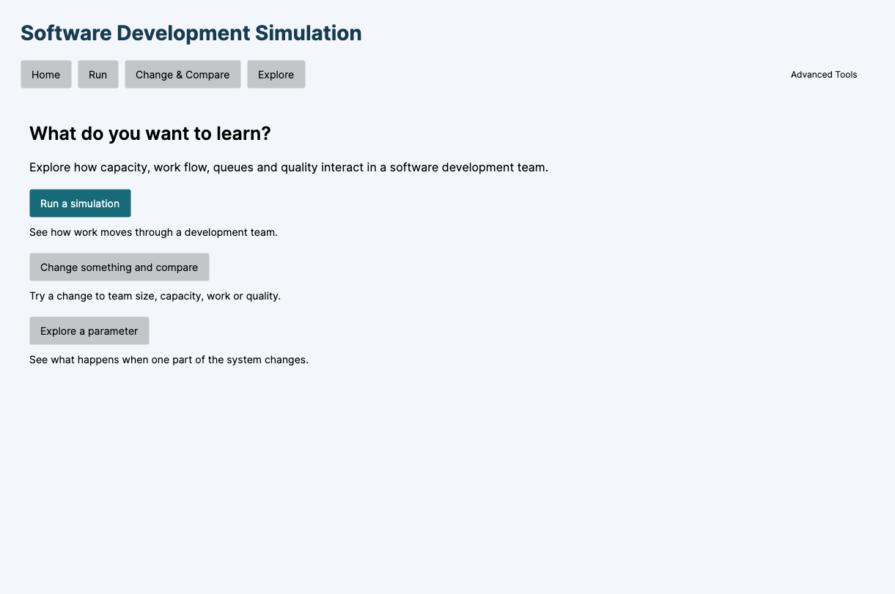
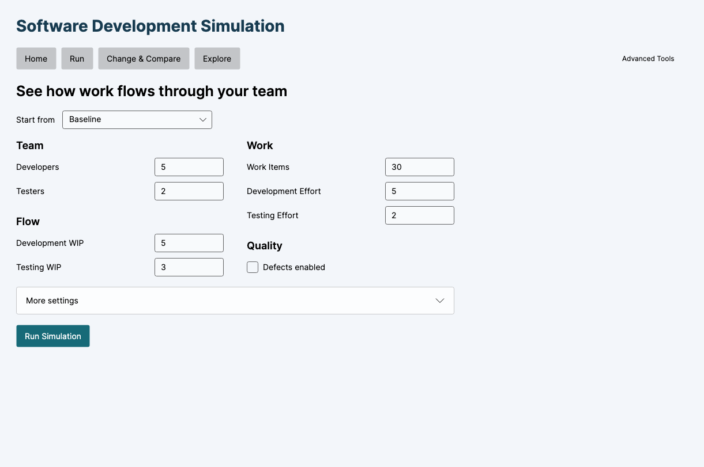
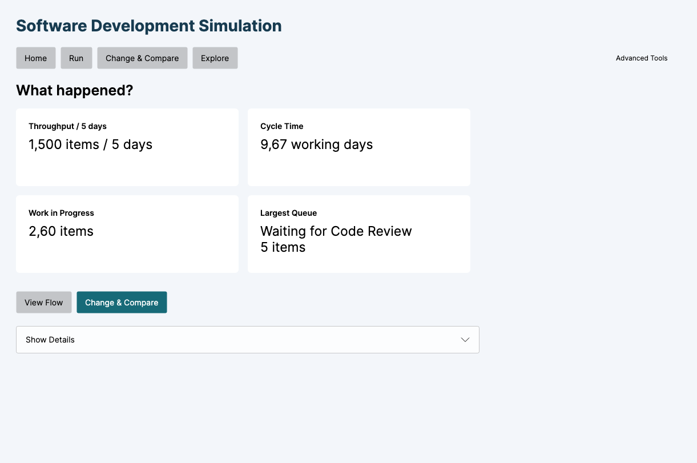
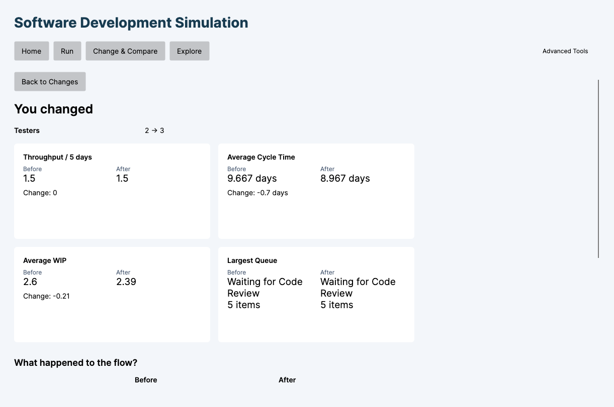
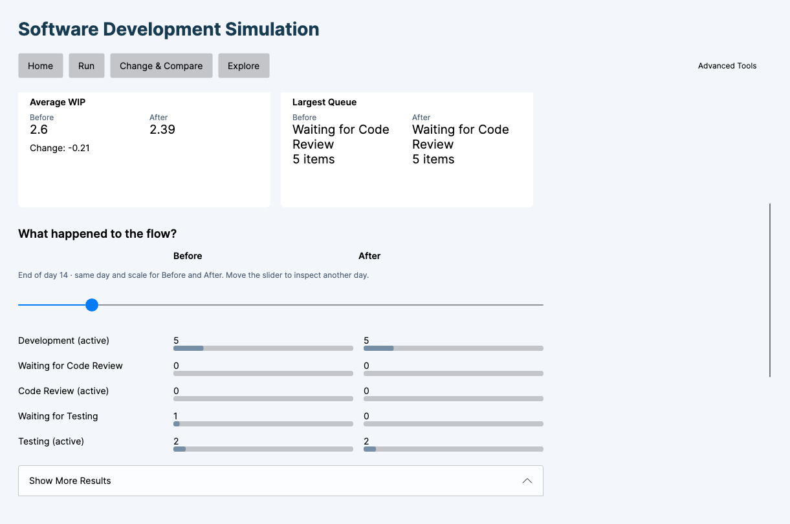
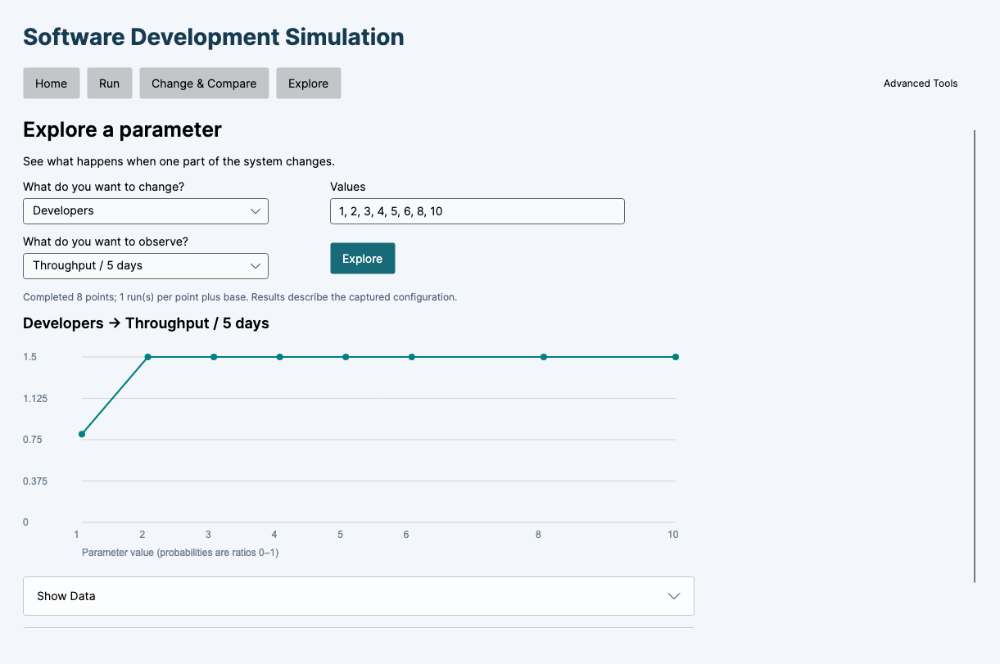

# Step 11B — Simple Mode

Historical design and verification record. Current navigation is **Live → Analyze → Advanced**, with Live startup; see [Live-first UX](LIVE_FIRST_UX.md). Legacy Home/Run components remain internally but are absent from the normal user journey.

The application now starts at Home, with three question-oriented paths: **Run**, **Change & Compare**, and **Explore**. **Advanced Tools** is a smaller secondary entry. This supersedes Step 11's default Simulate/Compare/Analyze navigation; that workspace remains available to experts.

## Run and results

Run starts with Baseline and a compact Team / Work / Flow / Quality setup. Basic fields are Developers, Testers, Work Items, fixed Development/Testing Effort, Development/Testing WIP and Defects. If a loaded preset uses variable effort, the simple view says so rather than replacing it with fixed effort. More settings retains simulation duration, review settings, capacity, seed, distributions and quality configuration. Presets include Baseline, Variable Effort and Defects & Rework; model-validation presets stay in advanced analysis.

Run Simulation calls the existing application runner. Results show four cards: Throughput / 5 days, Cycle Time, Work in Progress and Largest Queue. Values are read from the completed SimulationResult. Largest Queue selects the existing maximum end-of-day observation across review, testing and rework queues; it does not infer a bottleneck. Help remains on the cards. Show Details retains the detailed metrics, work-item table and histories.

View Flow uses the existing daily flow inspector with an explicit Back to Results action. Rework's feedback branch appears when the completed run enabled defects. This is day inspection, not a new playback engine.

## Change & Compare

The starting point is Baseline, or the captured configuration of the last completed simulation. Selecting Last simulation before a completed run gives a short explanation. Editing the Run form after a completed run does not change the captured starting point.

Current and Try values are shown together for Developers, Testers and active WIP limits. Defects uses Off/On and a checkbox. Developer/Tester Capacity are available in More things to change, including fractional values such as 1.4; they are not labelled AI. The full additional editor retains review effort, distributions, seeds and quality settings.

Run Comparison creates fresh internal before/after scenario identities and runs them through the existing ExperimentSession/ScenarioComparisonRunner. No duplication, naming or selector management is required. The starting request is immutable and the expert's existing experiment is not replaced. The simple pair is retained separately and can be inspected/saved/exported through Advanced Comparison → Current simple comparison.

You Changed contains only actual configuration differences (names are excluded). Three metric cards show authoritative throughput, cycle time and WIP values/differences, and a fourth shows each run's largest observed waiting queue. No cross-stage queue delta is invented. Differences are after minus before; utilization differences in additional results retain percentage points. Show More Results uses existing available comparison rows. Defect/rework rows follow the existing comparison service's visibility rules when quality is disabled.

Flow shows actual before/after observations on the same working day, with a shared scale. The initial day is the earliest shared day with the greatest absolute difference in a waiting-queue count. If all queue counts match, it keeps the existing largest-queue observation day. This selects an informative existing snapshot; it changes no simulation rule, metric or event. The slider spans the shared horizon. Largest Queue cards describe whole-run maxima, which need not occur on the displayed day. Longer-run observations remain available in expert comparison charts.

The simple comparison uses single-run mode and the starting point's seed for both runs. Changed configured seeds are preserved as parameters, but expert traceability explains effective seeds under the existing common-seed policy. For alternative independent seeds or Monte Carlo, use specialist comparison controls.

## Explore

Explore asks what to change, which values to try and what to observe. It calls the existing sensitivity analysis service. The default base is the last completed simulation, or the current Run setup when no completed simulation exists, with zero warm-up. Advanced analysis keeps its own original settings and validation presets.

The default parameter choices are Developers, Testers, Development WIP and Testing WIP. The result choices include throughput, cycle/lead time, average WIP, utilizations and explicitly named review/testing queue maxima. There is no invented aggregate "Largest Queue" percentile: queue choices name the measured stage. Additional parameters and metrics remain in Advanced Analysis.

One chart appears after execution; Show Data reveals values. Raw percentiles, run mode, warm-up and diagnostics remain in the collapsed Advanced Analysis view. If an expert enables Monte Carlo there, the simple chart labels its typical result as a median; no confidence interval or likely range is invented. No staffing recommendation or automatic good/bad classification is generated.

## Advanced capabilities retained

Advanced Tools contains the previous complete workspace:

- Scenario Manager / Experiments: add, duplicate, rename, edit, delete, import/save scenarios, save/load experiments, run all, full matrices and CSV export.
- Monte Carlo: distributions, percentiles and histograms.
- Advanced sensitivity analysis: all parameters, metrics, settings and diagnostics.
- Model Validation: extreme parameter checks, separate from ordinary use.
- Detailed results, item histories and daily charts.
- Common Random Numbers, paired signed delta distributions and traceability.

No simulation capability or persistence format was removed. Expert controls were removed from the primary journey, not from the application. The normal Run/Compare/Explore paths do not require knowledge of experiments or scenario management. Navigation to Home and back to results/changes remains available.

## Architecture and invariance

`SimpleWorkflowViewModel` owns navigation, input orchestration and presentation selection. It delegates runs and comparisons to the existing application layer. Separate simple-pair state protects the expert experiment. `MoreSettingsView`, `ResultFlowView` and `DetailedResultView` reuse existing input/result bindings; `AdvancedWorkspace` retains the previous expert UI. Views contain no simulation calculations.

Existing setup names are retained when a configuration is loaded. Sensitivity progress reporting now captures its synchronization context before worker execution and ignores callbacks from completed operations; this fixes cross-thread button notifications and does not alter analysis calculations.

All 31 source/project files in Core, Application and Infrastructure were checked against SHA-256 hashes captured before this task: no changes. Core remains a plain .NET project with no Avalonia reference. Capacity allocation, WIP, effort/random generation, defect/rework behaviour, numerical calculations and persistence remain unchanged. No continuous simulation or other new simulation feature was added.

## Verification

On macOS ARM64, .NET 10:

- Release solution build: successful, zero warnings/errors.
- **199 xUnit tests passed**: 77 Core, 80 Application, 42 UI. Eight new test cases cover simple configuration/results, hidden settings, Testers 2 → 3, independent starting data, multiple/no changes, actual queue observations, Explore service equivalence, baseline/defect numerical invariance, advanced access and validation errors.
- Actual Avalonia views were first rendered in headless/Skia mode, then exercised successfully in a native macOS window through bound controls and commands.
- Walkthrough: Home → default Run → four cards → Flow → Back to Results → Last simulation → Testers 2 → 3 → Run Comparison → changed parameters/four results/flow → Show More Results → Home → Explore Developers/Throughput → one chart.
- Expert check: Scenario Manager, experiment save/reload, CSV export, Monte Carlo execution and Model Validation navigation.
- Screenshots at approximately 1240×900 were inspected. Input widths are limited; empty initial charts, prominent expert tabs and disabled comparison prerequisites are absent from the normal path.
- An initial native launch failed with Avalonia RenderTimer error −6661; a subsequent native run completed the full workflow successfully.

This is an agent-driven UI walkthrough and visual review, not an independent first-time-human usability study. Existing scenario/experiment serialization regression tests remain green.

## Remaining usability limitations

Advanced Tools intentionally retains dense expert screens. Expanding detailed settings/tables requires scrolling. The app currently keeps one simple comparison pair at a time; save/export it through Advanced Comparison before replacing it. No recent-run history was added. The existing Flow view uses day selection, not playback. Explore defaults to stage-specific queue metrics rather than inventing a new aggregate metric. Percentiles remain specialist output, and uncertainty does not create a confidence interval.

## Files

Created:
- `src/Simulation.UI/ViewModels/SimpleWorkflowViewModel.cs`
- `src/Simulation.UI/Views/AdvancedWorkspace.axaml` and `.axaml.cs`
- `src/Simulation.UI/Views/MoreSettingsView.axaml` and `.axaml.cs`
- `src/Simulation.UI/Views/ResultFlowView.axaml` and `.axaml.cs`
- `src/Simulation.UI/Views/DetailedResultView.axaml` and `.axaml.cs`
- `tests/Simulation.UI.Tests/SimpleWorkflowTests.cs`
- `docs/SIMPLE_MODE.md`, `docs/screenshots/step11b-*.png`

Modified:
- `src/Simulation.UI/Views/MainWindow.axaml`
- `src/Simulation.UI/ViewModels/MainWindowViewModel.cs`
- `src/Simulation.UI/ViewModels/MainWindowPresentation.cs`
- `src/Simulation.UI/ViewModels/SimpleComparison.cs`
- `src/Simulation.UI/ViewModels/SensitivityViewModel.cs`
- `src/Simulation.UI/App.axaml.cs`
- `README.md`, `docs/SIMULATION_MODEL.md`

## Step 11C refinement

The same workflow now uses one-decimal primary results, compact queue names, one neutral flow observation and a subtle Advanced entry. See [formatting, observation priorities and verification](SIMPLE_UX_POLISH.md).
