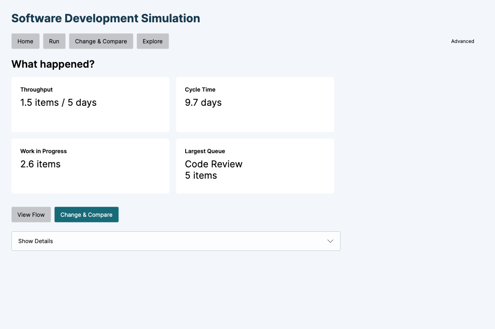
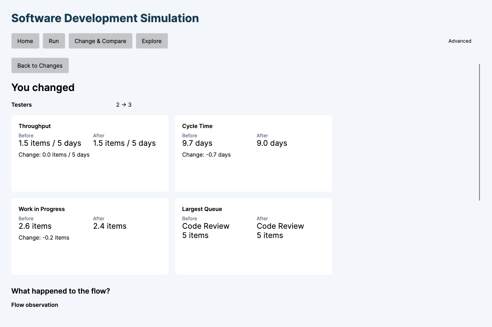
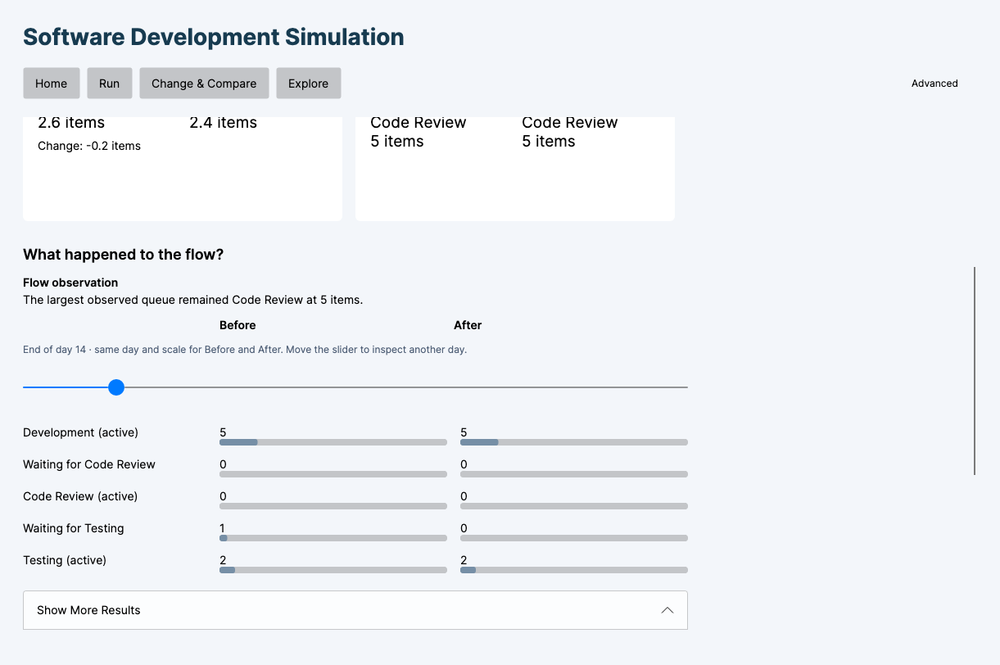

# Step 11C — focused Simple Mode polish

The Home → Run → What happened? → Change & Compare → You changed → What happened to the flow? workflow is unchanged. No simulation feature was added.

## Formatting

`SimpleResultPresentation` formats numeric result values directly, rather than parsing previously formatted strings. Primary result/comparison cards use one decimal, invariant English decimal points, and midpoint rounding away from zero. Near-zero signed changes display `0.0`, not `-0.0`. Differences use the existing comparison service's full-precision delta before rounding, never a subtraction of rounded endpoints. Additional simple comparison results use the same helper; utilization is formatted as whole percentages, with percentage-point differences retained. Detailed/expert screens keep their previous precision.

Examples: 1.500 → `1.5`; 9.667 → `9.7`; 8.967 → `9.0`; the actual cycle-time delta → `-0.7 days`. Underlying doubles are unchanged.

Primary terminology is Throughput, Cycle Time, Work in Progress and Largest Queue. The queue card shows compact names (Code Review, Testing or Rework), then the integer item count, separately for Before and After. The full flow diagram retains Waiting for … labels. Largest-queue selection and tie handling still use the existing QueueObservation implementation.

Explanations are attached through Avalonia's ordinary ToolTip.Tip; no tooltip-open state is bound or forced and no persistent explanation is inserted in the queue card. The queue card has no synthetic delta/footer. The small transparent secondary navigation entry is now **Advanced**, with an explanatory tooltip; all expert tools remain accessible.

## One factual Flow observation

Only completed single-run comparison results produce a flow observation. It is independent of the day slider and describes whole-run measurements. No observation is synthesized from Monte Carlo flow.

`SimpleFlowObservation` uses this deterministic priority:

1. Both largest queues are nonempty and their locations differ: report the locations.
2. The largest queue size changes by **at least 2 items**: report the counts. If one run has no queue, do not invent a queue location for that zero count.
3. Throughput changes by **at least 0.1 items / 5 days**: report its before/after values.
4. Largest queue location and count match: report that queue, or that neither run had an observed waiting queue. This deliberately precedes secondary time/WIP changes to keep the stable-queue example brief.
5. Throughput has the same one-decimal display value and Cycle Time changes by **at least 0.1 days**: report both facts in one sentence. Otherwise apply the same rule to Work in Progress, using **0.1 items**.
6. Otherwise: “No notable change in the primary results.” This means below these explicit presentation thresholds; it is not a statistical significance statement.

Threshold comparisons round absolute floating-point differences to ten decimal places to suppress subtraction artifacts at the 0.1 boundary. Display rounding remains one decimal. Thresholds are presentation choices, not simulation rules. Queue-location changes outrank queue sizes; counts outrank throughput. There is at most one observation, with no recommendation, causal explanation, ranking or bottleneck classification.

For the actual Baseline → Testers 3 run, the observation is generated as:

> The largest observed queue remained Code Review at 5 items.

## Verification

- All **212 xUnit tests pass**: 77 Core, 80 Application, 55 UI. This includes 13 new formatting/observation cases and an updated existing simple-format expectation.
- New coverage: Swedish-culture independence, one decimal, negative zero, raw-delta rounding, short queue names, distinct actual before/after queues, priority and threshold boundaries, absent queues, neutral language, deterministic text and unchanged serialized results.
- Native Avalonia workflow on macOS: baseline, four result cards, Flow, Testers 2 → 3, automatic comparison, observation, Show More Results, Explore, Advanced, experiment round trip/export and Monte Carlo all succeeded.
- The tooltip was verified closed initially, opened on explicit request and closed again. It was absent from the ordinary result screen. Native screenshots were visually reviewed at the existing window size. This is an automated native UI walkthrough with visual review, not an independent human usability study.
- Core/Application/Infrastructure source hashes were compared with the start of the task. No files changed; numerical regression tests remain green. Core still has no Avalonia dependency.

## Files

Created:
- `src/Simulation.UI/ViewModels/SimpleResultPresentation.cs` — formatting and neutral observation policy.
- `tests/Simulation.UI.Tests/SimplePolishTests.cs` — 13 new test cases.
- `docs/SIMPLE_UX_POLISH.md` and `docs/screenshots/step11c-*.png`.

Modified:
- `src/Simulation.UI/ViewModels/SimpleWorkflowViewModel.cs` — consumes numeric presentation helper and exposes the observation.
- `src/Simulation.UI/ViewModels/SimpleComparison.cs` — tooltip aliases for consistent simple metric names.
- `src/Simulation.UI/Views/MainWindow.axaml` — observation placement and subtle Advanced label.
- `tests/Simulation.UI.Tests/SimpleWorkflowTests.cs` — updated expected simple formatting.
- `docs/SIMPLE_MODE.md` — link to this refinement.

