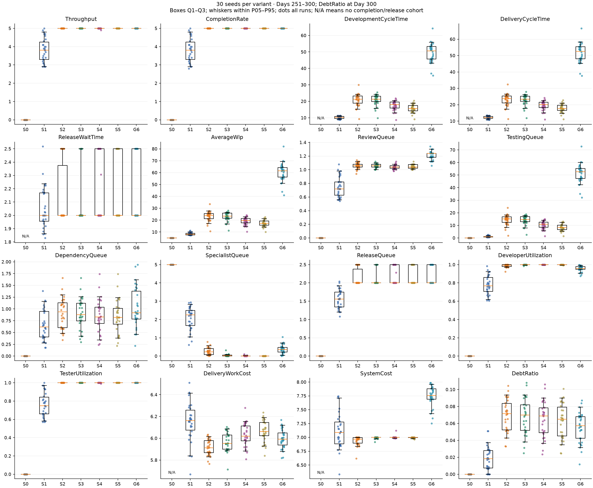
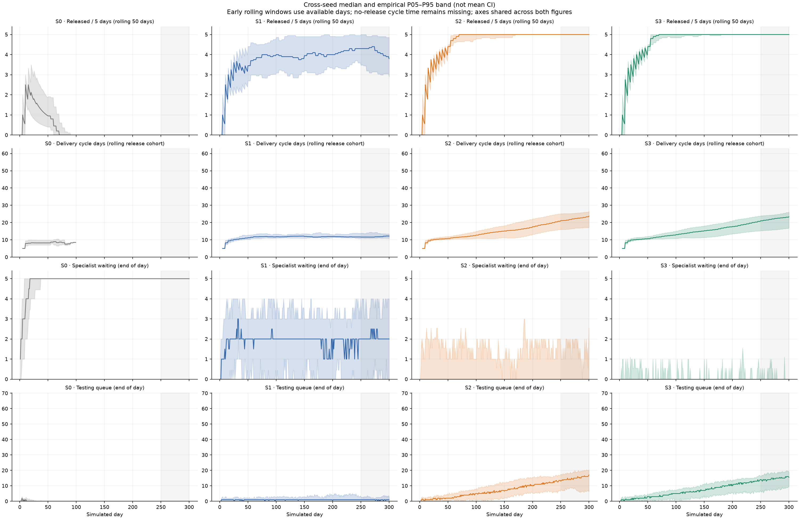
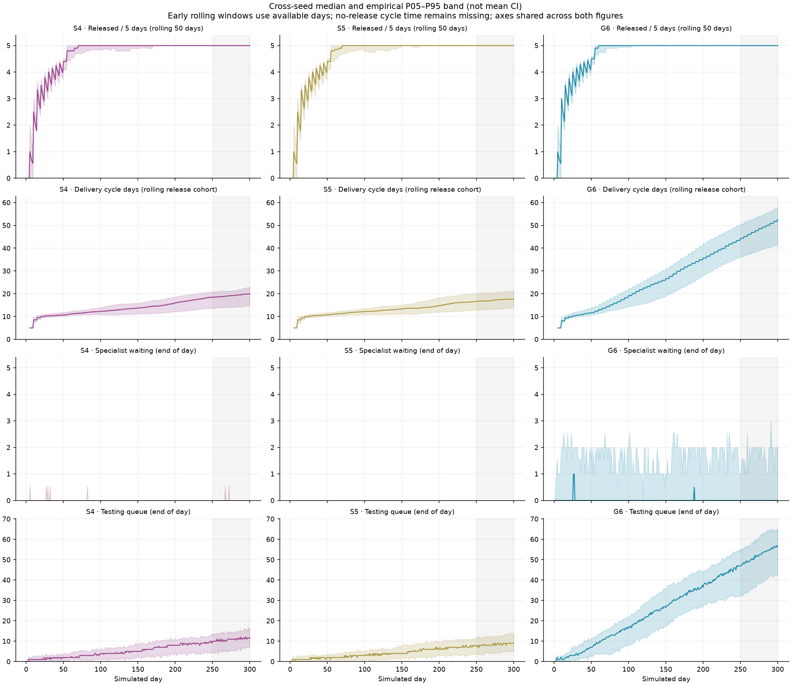

# Specialist Capacity Experiment v1

**Completed 2026-10-09. Verified model behavior, with competing performance objectives.**

Under the tested assumptions, **two specialists out of five developers are sufficient to reach the downstream release-rate ceiling**. More specialists substantially reduce specialist waiting but do not raise final-window throughput. Five specialists provide the lowest mean cycle time and Testing queue among the configurations that reach 5 releases per five days in every seed, while two provide the lowest mean Delivery Work Cost and System Cost among those configurations. Adding a sixth developer with the specialist count held at two increases congestion and cost without improving final-window throughput.

This is an analysis of model version 0.8, not a recommendation that real teams should have universally optimal specialist ratios. Production simulation and UI code are unchanged.

## 1. Controlled setup

All variants reuse `ModelValidationV2.Validation.Complex`, the exact definition underlying Scenario C in Multi-Seed Validation v1. S1 reproduces Scenario C's complete captured state, exported result and metrics **exactly for all 30 seeds**.

| Variant | Total developers | Specialists | General-only developers |
| --- | --- | --- | --- |
| S0 | 5 | 0 | 5 |
| S1 | 5 | 1 | 4 |
| S2 | 5 | 2 | 3 |
| S3 | 5 | 3 | 2 |
| S4 | 5 | 4 | 1 |
| S5 | 5 | 5 | 0 |
| G6 | 6 | 2 | 4 |

Fixed settings: two testers; availability 1; Development/Review/Testing productivity 1.5/1/1; fixed effort 5/1/2; active WIP limits 5/3/3; AlwaysAvailable supply; defects disabled; specialist-required rate 30%; residual dependency rate 25%, mean wait 4 days; scheduled releases every five days, capacity five items per opportunity. Debt settings remain shortcut rate .30, reduction .50, creation factor 2, tolerance .10, repayment .20, impact factor 1. All remaining settings are inherited unchanged. There are no interventions during these runs.

Seeds **12345–12374**, **300 days** per variant, main measurement window **Days 251–300 inclusive**: **210 primary runs**. Same-seed paired comparisons isolate the configured composition changes; G6−S2 isolates adding one general developer at fixed specialist count. Twenty-one extra replay runs cover all seven variants for seeds 12345, 12359 and 12374 and are excluded from the statistics.

[Exact requests and raw results](raw-results.json), [harness](Program.cs), [reproduction instructions](README.md).

## 2. Verified allocation rules and S0 semantics

Specialists are a **subset** of total developers, not additional capacity. Daily available developer capacity is exactly **5 in S0–S5** and **6 in G6**, verified on every simulated day. Skills affect Development only; specialists can do general work without a productivity penalty or price premium. The model has no training, recruitment, salary or skill-maintenance cost.

The implemented rules materially affect the experiment:

1. Code Review consumes the shared developer pool first, followed by Rework and debt repayment, then Development. Testing has its own pool.
2. When specialist work is admitted, remaining Development capacity is split proportionally: `remaining pool × specialists / total developers`. This is an aggregate allocation, not a roster of named people.
3. Specialist primary contributions occur first. With at least two specialists, specialist collaboration follows before general primary contributions. General work then uses the general pool plus leftover specialist capacity; general collaboration comes last.
4. An item has at most two contributions per day. The second has 50% effectiveness, and per-contribution raw capacity is capped. More raw utilization can therefore mean more collaboration overhead, rather than proportionally more output.
5. Development admission uses a shared WIP limit, without reserved general/specialist slots or bypassing an admitted stalled specialist item.

These behaviors are present in [SimulationEngine.cs](../../../src/Simulation.Core/SimulationEngine.cs). Existing [SkillsTests.cs](../../../tests/Simulation.Core.Tests/SkillsTests.cs) explicitly verifies general-only work using specialist capacity, mixed-work priority/fallback, collaboration eligibility, and specialist capacity falling back to general work after a specialist item completes. The full suite passed.

**S0 is valid but infeasible for sustained flow under these settings.** Specialist-required items consume no Development capacity, remain unfinished and eventually occupy all five Development slots. General work can initially complete, but the shared WIP limit then prevents further admissions. In every tested seed:

- Final-window specialist waiting is **5**, throughput and completion rate are **0**, and developer/tester utilization is **0**.
- The last Development completion occurs between **Day 5 and Day 45**; the last release between **Day 10 and Day 50**.
- Cumulative releases are **4–21**, mean **10.033**, before flow stalls.
- Final-window cycle times, release wait and per-completed/released-item costs are **unavailable**, not zero. All 30 S0 cost/cycle paired comparisons are unavailable; they cannot establish that S0 is cheaper or faster.

No behavior was changed to accommodate S0. A flat queue of five here indicates arrested flow, not a healthy stable regime.

## 3. Metrics and statistical method

Queue metrics are average daily end-of-day counts in Days 251–300; final queue sizes are separate. Specialist waiting is a subset of Development and dependency waiting a subset of Backlog; neither is double-counted in total WIP. Rates are items per five days, times are simulated days, and costs are raw capacity units per item, not money. Utilization and DebtRatio are fractions. DebtRatio is the Day-300 ratio, consistent with the preceding validation. Cumulative Released covers all 300 days.

Development cycle and Delivery Work Cost use the work-completed cohort. Delivery cycle and release wait use the released cohort. System Cost divides capacity consumed during the period by releases during the period. There is no imputation of missing cohorts.

Statistics use sample SD with n−1 and **Hyndman–Fan type-7 percentiles**: interpolate at zero-based position `(n−1)p` in sorted observations. Mean 95% intervals use Student t: `mean ± t(.975,n−1) × SD/√n`, with t(.975,29)=2.045229642. Paired statistics operate on the same-seed differences first, not independent samples of 60 outcomes. Direction counts use absolute tolerance 1e−9 before rounding. N and unavailable counts are explicit; no SD/CI is estimated from fewer than two observations.

The intervals quantify approximate Monte Carlo uncertainty in the mean under an independent pseudorandom-seed working assumption. Consecutive seeds do not establish independence. These are exploratory, unadjusted intervals across many metrics, not real-world prediction limits. Empirical P05/P95 describe observed cross-seed variation; they are not mean confidence limits.

## 4. Full quantitative comparison

Main table: **means across 30 seeds**. [Complete statistics](scenario-summary.md) include mean, median, sample SD, min/max, P05/P95 and mean CI for every requested metric, cumulative Released, final queues and extra allocation/flow diagnostics. [Machine-readable summary](summary.json).

| Metric | S0 | S1 | S2 | S3 | S4 | S5 | G6 |
| --- | --- | --- | --- | --- | --- | --- | --- |
| Throughput | 0 | 3.810 | 5 | 5 | 4.997 | 5 | 5 |
| CompletionRate | 0 | 3.807 | 5 | 5 | 5 | 5 | 5 |
| DevelopmentCycleTime | N/A | 10.154 | 20.906 | 20.843 | 17.479 | 15.671 | 49.361 |
| DeliveryCycleTime | N/A | 12.201 | 23.033 | 22.924 | 19.633 | 17.833 | 51.491 |
| ReleaseWaitTime | N/A | 2.053 | 2.133 | 2.083 | 2.160 | 2.167 | 2.167 |
| AverageWip | 5 | 8.481 | 23.233 | 23.084 | 19.345 | 17.314 | 60.262 |
| DeveloperUtilization | 0 | 0.775 | 0.988 | 0.999 | 1.000 | 0.999 | 0.957 |
| TesterUtilization | 0 | 0.758 | 1 | 1 | 1.000 | 1 | 1 |
| SpecialistQueue | 5 | 2.065 | 0.254 | 0.041 | 0.009 | 0.001 | 0.369 |
| ReviewQueue | 0 | 0.750 | 1.060 | 1.056 | 1.040 | 1.047 | 1.214 |
| TestingQueue | 0 | 1.009 | 14.324 | 14.217 | 10.400 | 8.345 | 51.324 |
| DependencyQueue | 0 | 0.663 | 0.914 | 0.903 | 0.856 | 0.842 | 1.026 |
| ReleaseQueue | 0 | 1.558 | 2.133 | 2.083 | 2.159 | 2.167 | 2.167 |
| DeliveryWorkCost | N/A | 6.152 | 5.916 | 5.966 | 6.030 | 6.063 | 5.995 |
| SystemCost | N/A | 7.112 | 6.939 | 6.994 | 7.002 | 6.995 | 7.741 |
| DebtRatio | 0 | 0.018 | 0.069 | 0.068 | 0.065 | 0.063 | 0.056 |
| ReleasedCumulative | 10.033 | 235.833 | 292.967 | 293.567 | 293.200 | 292.933 | 294.933 |

Selected cross-seed variation:

| Variant | Throughput SD | Cycle SD | Cycle P05–P95 | Testing queue SD | System Cost SD |
| --- | --- | --- | --- | --- | --- |
| S0 | 0.000 | N/A | N/A | 0.000 | N/A |
| S1 | 0.648 | 0.801 | 10.894–13.383 | 0.512 | 0.320 |
| S2 | 0.000 | 3.840 | 17.141–26.585 | 4.160 | 0.080 |
| S3 | 0.000 | 3.395 | 16.943–26.213 | 3.612 | 0.017 |
| S4 | 0.018 | 2.792 | 14.887–22.900 | 3.051 | 0.023 |
| S5 | 0.000 | 2.512 | 13.970–21.375 | 2.664 | 0.010 |
| G6 | 0.000 | 5.983 | 41.770–58.202 | 7.767 | 0.184 |

S1 throughput varies from **2.9 to 5.0**, whereas S2, S3, S5 and G6 reach **5.0 in every final window**. S4 has one exception, seed **12354**, at **4.9**. Flat throughput does not imply all outcomes are identical: Delivery Cycle Time SD is **3.840** days for S2 and **2.512** for S5, and **5.983** for G6.

## 5. Paired comparisons

The compact table gives key outcomes against S1, the additional-capacity comparison G6−S2, and the direct trade-off S5−S2. [Full paired table](paired-comparison.md) also gives median and SD of differences for every metric and adjacent composition steps; [paired JSON](paired.json) retains all differences in seed order 12345–12374.

| Pair | Metric | Mean Δ | 95% CI for mean Δ | Up / down / tie | Unavailable |
| --- | --- | --- | --- | --- | --- |
| S0 − S1 | Throughput | -3.810 | [-4.052, -3.568] | 0 / 30 / 0 | 0 |
| S0 − S1 | DeliveryCycleTime | N/A | N/A | 0 / 0 / 0 | 30 |
| S0 − S1 | TestingQueue | -1.009 | [-1.201, -0.818] | 0 / 30 / 0 | 0 |
| S0 − S1 | SpecialistQueue | 2.935 | [2.702, 3.168] | 30 / 0 / 0 | 0 |
| S0 − S1 | DeliveryWorkCost | N/A | N/A | 0 / 0 / 0 | 30 |
| S0 − S1 | SystemCost | N/A | N/A | 0 / 0 / 0 | 30 |
| S2 − S1 | Throughput | 1.190 | [0.948, 1.432] | 29 / 0 / 1 | 0 |
| S2 − S1 | DeliveryCycleTime | 10.831 | [9.282, 12.381] | 29 / 1 / 0 | 0 |
| S2 − S1 | TestingQueue | 13.315 | [11.775, 14.854] | 30 / 0 / 0 | 0 |
| S2 − S1 | SpecialistQueue | -1.811 | [-2.062, -1.560] | 0 / 30 / 0 | 0 |
| S2 − S1 | DeliveryWorkCost | -0.236 | [-0.303, -0.168] | 2 / 28 / 0 | 0 |
| S2 − S1 | SystemCost | -0.174 | [-0.299, -0.049] | 10 / 20 / 0 | 0 |
| S3 − S1 | Throughput | 1.190 | [0.948, 1.432] | 29 / 0 / 1 | 0 |
| S3 − S1 | DeliveryCycleTime | 10.723 | [9.404, 12.042] | 29 / 1 / 0 | 0 |
| S3 − S1 | TestingQueue | 13.207 | [11.864, 14.550] | 30 / 0 / 0 | 0 |
| S3 − S1 | SpecialistQueue | -2.025 | [-2.259, -1.790] | 0 / 30 / 0 | 0 |
| S3 − S1 | DeliveryWorkCost | -0.186 | [-0.256, -0.115] | 6 / 24 / 0 | 0 |
| S3 − S1 | SystemCost | -0.119 | [-0.239, 0.001] | 11 / 19 / 0 | 0 |
| S4 − S1 | Throughput | 1.187 | [0.946, 1.428] | 29 / 0 / 1 | 0 |
| S4 − S1 | DeliveryCycleTime | 7.432 | [6.339, 8.525] | 29 / 1 / 0 | 0 |
| S4 − S1 | TestingQueue | 9.391 | [8.274, 10.508] | 30 / 0 / 0 | 0 |
| S4 − S1 | SpecialistQueue | -2.057 | [-2.291, -1.822] | 0 / 30 / 0 | 0 |
| S4 − S1 | DeliveryWorkCost | -0.122 | [-0.194, -0.049] | 8 / 22 / 0 | 0 |
| S4 − S1 | SystemCost | -0.111 | [-0.231, 0.010] | 13 / 17 / 0 | 0 |
| S5 − S1 | Throughput | 1.190 | [0.948, 1.432] | 29 / 0 / 1 | 0 |
| S5 − S1 | DeliveryCycleTime | 5.632 | [4.616, 6.648] | 29 / 1 / 0 | 0 |
| S5 − S1 | TestingQueue | 7.336 | [6.384, 8.288] | 30 / 0 / 0 | 0 |
| S5 − S1 | SpecialistQueue | -2.065 | [-2.298, -1.831] | 0 / 30 / 0 | 0 |
| S5 − S1 | DeliveryWorkCost | -0.088 | [-0.158, -0.018] | 8 / 22 / 0 | 0 |
| S5 − S1 | SystemCost | -0.117 | [-0.237, 0.002] | 13 / 17 / 0 | 0 |
| G6 − S1 | Throughput | 1.190 | [0.948, 1.432] | 29 / 0 / 1 | 0 |
| G6 − S1 | DeliveryCycleTime | 39.289 | [36.923, 41.655] | 30 / 0 / 0 | 0 |
| G6 − S1 | TestingQueue | 50.315 | [47.432, 53.198] | 30 / 0 / 0 | 0 |
| G6 − S1 | SpecialistQueue | -1.696 | [-1.961, -1.431] | 0 / 30 / 0 | 0 |
| G6 − S1 | DeliveryWorkCost | -0.156 | [-0.228, -0.085] | 6 / 24 / 0 | 0 |
| G6 − S1 | SystemCost | 0.629 | [0.493, 0.765] | 28 / 2 / 0 | 0 |
| G6 − S2 | Throughput | 0 | [0.000, 0.000] | 0 / 0 / 30 | 0 |
| G6 − S2 | DeliveryCycleTime | 28.458 | [27.030, 29.886] | 30 / 0 / 0 | 0 |
| G6 − S2 | TestingQueue | 37.000 | [35.104, 38.896] | 30 / 0 / 0 | 0 |
| G6 − S2 | SpecialistQueue | 0.115 | [-0.002, 0.233] | 21 / 9 / 0 | 0 |
| G6 − S2 | DeliveryWorkCost | 0.079 | [0.063, 0.095] | 29 / 1 / 0 | 0 |
| G6 − S2 | SystemCost | 0.803 | [0.724, 0.882] | 30 / 0 / 0 | 0 |
| S5 − S2 | Throughput | 0 | [0.000, 0.000] | 0 / 0 / 30 | 0 |
| S5 − S2 | DeliveryCycleTime | -5.199 | [-6.173, -4.226] | 1 / 29 / 0 | 0 |
| S5 − S2 | TestingQueue | -5.979 | [-7.088, -4.870] | 1 / 29 / 0 | 0 |
| S5 − S2 | SpecialistQueue | -0.253 | [-0.327, -0.179] | 0 / 29 / 1 | 0 |
| S5 − S2 | DeliveryWorkCost | 0.148 | [0.128, 0.167] | 30 / 0 / 0 | 0 |
| S5 − S2 | SystemCost | 0.057 | [0.027, 0.086] | 22 / 1 / 7 | 0 |

**S2−S1:** throughput rises in **29 seeds and ties in one**, mean **+1.190** per five days (95% CI **0.948–1.432**). Specialist waiting falls in **30/30**, mean **−1.811** items, and developer utilization rises in **30/30**, mean **+21.221 percentage points**. However, Testing waiting rises in **30/30**, mean **+13.315** items; Delivery Cycle Time rises in **29/30**, mean **+10.831 days**. Work Cost falls in 28 seeds and rises in 2. System Cost falls in 20 and rises in 10: its average reduction is not universal.

**Beyond two specialists:** S3, S4 and S5 do not offer a sustained throughput gain. Average specialist waiting falls from S2 **0.254** to S3 **0.0407**, S4 **0.0087**, S5 **0.0007**. The principal throughput benefit has diminishing returns at **two**, even though additional composition changes still affect queueing and allocation.

**S5−S2:** same final-window throughput in all 30 seeds. Mean cycle reduction **5.199 days** (CI **4.226–6.173 days lower**); it is lower in 29 seeds and higher by 0.820 days for seed **12353**. Average Testing queue falls **5.979** items (CI **4.870–7.088 lower**) in 29/30. Work Cost **increases in all 30**, mean **+0.148**, and System Cost rises on average **+0.057** (CI **0.027–0.086**), with 22 increases, 1 decrease and 7 ties. Therefore S5 does not dominate S2 across the objectives.

## 6. Bottleneck and cost analysis

Counts below cover the final 50-day window. With defects disabled, each Development completion creates incoming Review demand, and each Review completion creates incoming Testing demand. This directly measures downstream flow, not merely an inferred pressure from queue size.

| Variant | Dev complete → Review | Review complete → Testing | Released | Review queue avg | Testing queue avg | Release wait days | Final Testing queue | Final Release queue |
| --- | --- | --- | --- | --- | --- | --- | --- | --- |
| S0 | 0 | 0 | 0 | 0 | 0 | N/A | 0 | 0 |
| S1 | 37.300 | 37.333 | 38.100 | 0.750 | 1.009 | 2.053 | 1 | 0 |
| S2 | 52.833 | 53.100 | 50 | 1.060 | 14.324 | 2.133 | 16 | 0.167 |
| S3 | 52.533 | 52.600 | 50 | 1.056 | 14.217 | 2.083 | 15.367 | 0.033 |
| S4 | 51.767 | 52.067 | 49.967 | 1.040 | 10.400 | 2.160 | 11.300 | 0.167 |
| S5 | 51.867 | 51.067 | 50 | 1.047 | 8.345 | 2.167 | 8.700 | 0.100 |
| G6 | 60.033 | 59.667 | 50 | 1.214 | 51.324 | 2.167 | 55.900 | 0.200 |

Moving from S1 to S2 raises average Development completions **37.30→52.83** and Review completions **37.33→53.10**, while Testing/releases settle at **50 per window**. Review queue increases modestly **0.75→1.06**; Testing queue rises **1.009→14.324**. Review receives more work but its priority prevents a comparable accumulating queue in these runs. Testing utilization moves from **75.77% to 100%**.

Testing and release settings each impose a long-run ceiling of **one item/day** here: two units of tester capacity per day with two units of Testing effort per item, and five releases per five days. The large accumulating queue is before Testing. Release queues remain small and periodic, with mean release waits around **2.05–2.17 days**; capacity settings alone cannot distinguish which of these coincident ceilings would limit throughput after a different counterfactual change. No release-capacity ablation was run.

More specialists do not monotonically increase downstream congestion: S1→S2 sharply increases it, while S2→S5 reduces it without raising throughput. The allocation diagnostics help explain why these are not interchangeable staffing settings:

| Variant | Dev raw capacity | Collaboration raw capacity (subset) | Review raw capacity | Debt repayment raw capacity |
| --- | --- | --- | --- | --- |
| S0 | 0 | 0 | 0 | 0 |
| S1 | 116.913 | 22.410 | 37.333 | 39.627 |
| S2 | 154.446 | 7.952 | 53.100 | 39.380 |
| S3 | 157.597 | 14.448 | 52.600 | 39.480 |
| S4 | 158.234 | 20.553 | 52.067 | 39.587 |
| S5 | 158.899 | 24.091 | 51.067 | 39.787 |
| G6 | 179.340 | 19.232 | 59.667 | 48.067 |

From S2 to S5, average raw Development capacity rises **154.446→158.899**, but collaboration capacity rises **7.952→24.091**. Collaboration is already included in Development capacity and must not be added again. Review completions fall **53.10→51.067**. More capacity spent on half-effective second contributions is consistent with lower downstream inflow and slower queue accumulation. This is evidence of the model's dispatch/collaboration behavior, not proof that real-world specialists intrinsically reduce productivity. The experiment does not independently isolate this mechanism from changed item timing, debt paths and random-stream consumption.

S5 consequently has a lower Testing queue and cycle time than S2, while its per-item work cost is higher. S1's low queue/cycle comes with underused capacity and lower throughput. Neither high utilization nor low item cost alone identifies an optimum.

## 7. One additional general developer: G6 versus S2

G6 changes only total developers **5→6**, keeping **two specialists**. This increases nominal available developer capacity by **20%**, unlike the S0–S5 composition experiment.

- Final-window throughput is **unchanged in 30/30** seeds at 5 per five days.
- Delivery Cycle Time rises **23.033→51.491 days**, paired mean **+28.458** (CI **27.030–29.886**), higher in **30/30**.
- Average Testing queue rises **14.324→51.324**, paired **+37.000** (CI **35.104–38.896**), higher in **30/30**.
- System Cost rises **6.939→7.741**, paired **+0.803** (CI **0.724–0.882**), higher in **30/30**.
- Work Cost rises **5.916→5.995**, higher in 29/30.
- Developer utilization falls **98.77%→95.69%** on average, though more raw developer capacity is consumed. Utilization has a larger denominator in G6.
- Cumulative Released increases by **1.967 items** on average (CI **1.545–2.388**), with 28 increases and 2 ties. Thus there is a small transient benefit, even though final-window delivery rate does not improve.

Specialist waiting does not vanish with the extra general developer: it increases on average **0.254→0.369**, with 21 increases and 9 decreases; its mean-difference CI crosses zero. The proportional residual-pool split and changed work arrival/timing mean fixed specialist headcount is not a guarantee of identical daily specialist service. The model does not maintain named-person calendars.

For the current downstream settings, adding one general developer is a poor trade-off for steady delivery rate, delay and cost. This does not rule out benefit under different Testing, release, WIP or demand assumptions.

## 8. Time-series and accumulation

[Raw histories](time-series.json) retain all 300 days for every run. [Cross-seed bands](time-series-bands.json) include per-day median, empirical P05/P95 and valid sample count. These are pointwise outcome bands, not mean confidence intervals. Throughput and cycle use authoritative rolling 50-day histories, with partial windows before Day 50; queues are daily end states. Successive overlapping windows are correlated and not extra independent observations. S0 no-release cycle values remain missing; late S0 cycle summaries, while they exist, use only seeds still having releases within their rolling window.

The following cross-seed means of daily Testing queues cover six consecutive blocks, rather than relying only on the final measurement window:

| Variant | Days 1–50 | 51–100 | 101–150 | 151–200 | 201–250 | 251–300 |
| --- | --- | --- | --- | --- | --- | --- |
| S0 | 0.217 | 0 | 0 | 0 | 0 | 0 |
| S1 | 0.846 | 0.965 | 1.073 | 1.246 | 1.381 | 1.009 |
| S2 | 1.462 | 3.517 | 5.767 | 8.979 | 11.576 | 14.324 |
| S3 | 1.587 | 3.673 | 5.881 | 8.741 | 11.411 | 14.217 |
| S4 | 1.397 | 2.824 | 4.326 | 6.561 | 8.434 | 10.400 |
| S5 | 1.343 | 2.464 | 3.606 | 5.422 | 6.885 | 8.345 |
| G6 | 3.470 | 12.054 | 21.604 | 32.237 | 41.509 | 51.324 |

- **S0:** complete flow stoppage after early general work drains. Specialist waiting is five from the second block onward; zero output is persistent.
- **S1:** variable specialist limitation, small downstream queues. No sustained aggregate Testing accumulation across blocks, but throughput remains seed-dependent. This is not a proof of stationarity or long-run stability.
- **S2/S3:** throughput approaches the ceiling while Testing queues and cycle times continue to rise. Last-block mean Testing slopes are approximately **+0.0515/+0.0492 items/day**.
- **S4/S5:** slower but still positive aggregate accumulation throughout the observed horizon. Last-block mean Testing slopes are **+0.0354/+0.0260 items/day**. S5 is better than S2 on delay at Day 300, but has not demonstrated stable queues.
- **G6:** much faster accumulation: block mean Testing queue **3.470→12.054→21.604→32.237→41.509→51.324**; final-block slope **+0.2002 items/day**. Final Testing queue averages **55.9** versus **16.0** for S2. A throughput plateau masks continued deterioration in delay.

Review block means stay near one item in S2–S5 and approximately 1.2 in G6; Ready-for-Release block means settle around 2.1–2.2. These queues show bounded periodic behavior over this horizon, unlike Testing. Individual seeds may have temporary falls; statements above describe aggregate observed trajectories, not monotonic growth for every seed.

[Regime data](regimes.json) contain block means and within-block OLS slope distributions, including Review and Release diagnostic histories. Block means of rolling cycle/throughput endpoints are distinct from the single Day-300 rolling metric used in the main comparison.

## 9. Verification and test/build evidence

- **210/210 primary runs passed** Model Validation v2's checker; no seed-specific invariant failures.
- **63,000 audited days**, **8,575,468 audited item-day observations**.
- Constant developer capacity, specialist subset/eligible pool, WIP limits, allocation priorities, nonnegative/bounded capacity, cost event reconciliation, item uniqueness/conservation, release FIFO/scheduling, dependencies, effort conservation and debt accounting passed. S0 specialist items consumed zero Development capacity on every day.
- **21/21 deterministic replays** matched exact complete state, exported results and final metric dictionaries: seven variants × seeds 12345, 12359, 12374. Complete state includes history and random streams. [Validation log](validation.log).
- **S1 matched archived Scenario C exactly for all 30 seeds**, including complete state and results. Statistical tooling checks dataset coverage, 300-day histories, replay coverage and known percentile/SD/t-critical values. [Analysis log](analysis.log).
- **597 tests passed:** Core 218, Application 216, UI 163; zero failures or skips. [Full tests](tests.log).
- Full Release solution and experiment-harness builds passed with **0 warnings, 0 errors**. [Solution build](build.log), [harness build](harness-build.log).
- Before/after SHA-256 comparison confirms **104 production source files unchanged**. [Integrity evidence](production-integrity.json).
- PNG figures were visually inspected; standalone SVG versions are supplied. No charts or panels were added to the production UI.

All artifacts and pinned Python dependencies are in this folder. [README reproduction commands](README.md) rebuild/run the C# harness and statistical analysis. JSON records are keyed by variant and seed because concurrent execution may change array order without changing results.

## 10. Conclusions, limitations and recommendations

**Verified model behavior:** specialists are a subset of developers; they can do general work; shared pool priorities, proportional specialist allocation, collaboration inefficiency and shared WIP are active. Zero specialists can permanently block admitted specialist work. Accounting, determinism and original-baseline equivalence hold.

**Experimental observations:** two specialists remove specialist service as the primary observed final-window throughput constraint in this configuration. Replacing one general developer with a specialist (S1→S2) raises throughput and utilization but shifts waiting to Testing and increases delivery delay. Further specialists have diminishing throughput returns. S5 lowers delay versus S2 in 29/30 seeds, at higher work cost in all seeds. An additional general developer produces no final-rate benefit and increases delay, Testing queues and System Cost in all 30 seeds.

**Choice depends on the objective, without an artificial score:**

- **S2 is the smallest tested specialist complement that consistently reaches maximum final-window throughput**, with the lowest mean Work Cost and System Cost among configurations that reach that rate in all seeds. It is the natural reference if specialist coverage and capacity efficiency matter most.
- **S5 gives the best observed mean cycle/queue outcome among configurations with the maximum rate in all seeds** (17.833 days versus S2's 23.033), and near-total developer utilization. Its mean System Cost is only 0.057 higher, but its Work Cost is 0.148 higher and its Testing queue still grows. It is the stronger delay-oriented candidate under the explicit assumption that every developer can gain specialist capability without training or salary cost.
- **S1 has the shortest mean cycle time among productive variants** (12.201 days) and little downstream congestion, but mean throughput is 3.81 and capacity is underused. It remains a trade-off if shorter observed delays matter more than delivered volume; do not confuse starving a bottleneck with improving its service.
- **S3/S4 are intermediate composition choices**, without a higher mean throughput; no training/cost model is available to price such partial skill coverage.
- **G6 is not supported as a remedy for the current delivery bottleneck.** Its small cumulative-release gain is outweighed on the measured rate/delay/cost objectives. A useful future experiment would hold composition fixed while varying Testing capacity or work admission/WIP, then separately vary release capacity. Those changes were not made here.

The best balance is therefore **S2 for minimum specialist coverage and cost, or S5 for lower delay at full throughput**, depending on priorities. No tested high-throughput variant demonstrates non-accumulating Testing queues over the full horizon, so none should be declared a globally optimal or stable system configuration.

**Assumptions and limitations:** 30 deterministic seeds characterize variation under this particular model, demand mix, supply policy and 300-day horizon; they are not real-world forecasting uncertainty. Outcomes concern different completion/release cohorts across configurations. Paired seeds do not freeze identical item paths once timing and random-stream consumption diverge. All five developers being specialists carries no modeled training, salary or general-skill penalty; changing those assumptions could change the preference. Review, debt, collaboration, dependencies, shared WIP, fixed tester capacity and the matching release ceiling jointly shape the result. There is no empirical validation of universal team staffing ratios and no extrapolation of the 300-day queue trends to an untested long-run equilibrium.
